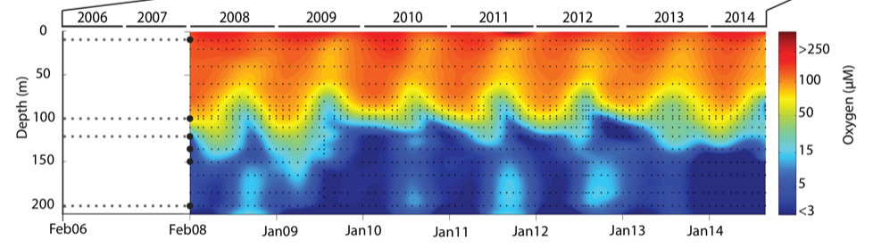

# Introduction to the tidyverse

## Introduction

In this workshop series, we will learn to manipulate and visualize real world data using packages in the [tidyverse](https://www.tidyverse.org/).

You will learn how to:

* create an R project and import data from a file into R,
* create subsets of rows or columns from data frames using dplyr,
* select pieces of an object by indexing using element names or position,
* change your data frames between wide and narrow formats,
* create various types of graphics,
* modify the various features of a graphic, and
* save your graphic in various formats

This comprehensive introduction to the tidyverse workshop series is ideal for beginners but assumes some prior experience with R (such as that in our [Introduction to R workshop](https://github.com/EDUCE-UBC/workshops_R/tree/main/intro_R_2hr)).


### Setup intructions
Please come to the workshop with your laptop setup with the required
software and data files as described in our [setup instructions](setup/tidyverse_setup.html).

### Background
Please read [Hallam SJ *et al*. 2017. Sci Data 4: 170158](https://www.ncbi.nlm.nih.gov/pmc/articles/PMC5663219/) "Monitoring microbial responses to ocean deoxygenation in a model oxygen minimum zone" to learn more about the data used in this workshop. You can also check out this [short video](https://youtu.be/XYQSm2Me86I) showing how the sampling was done!

## Data description
The data in this workshop were collected as part of an on-going oceanographic time series program in Saanich Inlet, a seasonally anoxic fjord on the East coast of Vancouver Island, British Columbia (Figure 1). 

<br>
<br>
{width=4in}
/

**Figure 1.** Map of Saanich Inlet indicating conventional sample collection stations (S1-S9). Data used in this workshop is sourced from S3.
<br>
<br>

Saanich Inlet is a steep sided fjord characterized by a shallow glacial sill located at the mouth of the inlet that restricts circulation in basin waters below 100 m (Figure 2).

<br>
<br>

/ 

**Figure 2.** Structure of Saanich Inlet. The glacial sill restricts water circulation into and out of the lower depth of the inlet basin.
<br>
<br>

During spring and summer months, elevated primary production (like photosynthesis) in surface waters combined with restricted circulation results in progressive water column stratification and complete oxygen starvation (anoxia) in deep basin waters. In late summer, pulses of oxygenated nutrient-rich ocean waters upwelling from the Haro Straight cascade over the sill, displacing oxygen starved bottom waters upward. The intensity of these renewal events varies from year to year with implications for microbial ecology and biogeochemical cycles (Figure 3). 

<br>
<br>

/ 

**Figure 3.** Contour plot of water column oxygen concentrations over multiple years in the time series. Warmer colors indicate high oxygen concentrations while cooler colors are low. Note the recurring pattern of oxygen decline below 100 m depth intervals followed by seasonal renewal events in late Summer into early Fall carrying more oxygenated waters into the Inlet. 
<br>
<br>

The seasonal cycle of stratification and deep water renewal enables spatial and temporal profiling across a wide range of water column energy states and nutrients, thus making Saanich Inlet a model ecosystem for studying microbial community responses to ocean deoxygenation. Ocean deoxygenation is a widespread phenomenon currently increasing due to climate change. 

The data we will use in this workshop include various geochemical measurements at many depths in Saanich Inlet. Samples were taken approximately monthly from 2006 to 2014, though there is much missing data to contend with.

For a brief introduction to the data used in this workshop series, see [Hallam SJ *et al*. 2017. Sci Data 4: 170158](https://www.ncbi.nlm.nih.gov/pmc/articles/PMC5663219/) "Monitoring microbial responses to ocean deoxygenation in a model oxygen minimum zone". More detailed information on the environmental context and time series data can be found in [Torres-Beltrán M *et al*. 2017. Sci Data 4: 170159.](https://www.nature.com/articles/sdata2017159) "A compendium of geochemical information from the Saanich Inlet water column".

## Getting Started

### Making an RStudio project
Projects allow you to divide your work into self-contained contexts. 

Let's create a project to work in.

In the top-right corner of your RStudio window, click the "Project: (None)" button to show the projects dropdown menu. Select "New Project..." > "New Directory" > "New Project." Under directory name, input "intro_tidyverse" and choose a parent directory to contain this project on your computer.

### Installing and loading packages

At the beginning of every R script, you should have a dedicated space for loading R packages. R packages allow any R user to code reproducible functions and share them with the R community. Packages exist for anything ranging from microbial ecology to complex graphics to multivariate modeling and beyond. 

In this workshop, we will use several packages within the [tidyverse](https://www.tidyverse.org/), in particular `dplyr`, `tidyr`, and `ggplot2`. Since these packages are used together so frequently, they can be downloaded and loaded into R all together as the "tidyverse". We will also use the packages `lubridate` and `cowplot`.

Here, we load the necessary packages which *must already be installed* (see [setup instructions](setup/tidyverse_setup.html) for details).
```{r, message=FALSE}
library(tidyverse) # Easily Install and Load the 'Tidyverse'
library(lubridate) # Make Dealing with Dates a Little Easier
library(cowplot) # Streamlined Plot Theme and Plot Annotations for 'ggplot2'
library(patchwork) # The Composer of Plots
```

### Downloading the data

The following command downloads the data from our [GitHub](https://github.com/EDUCE-UBC/workshops_access) and since you're working in a Project, saves it in the Project directory under the `data` directory on your computer.

```{r, message=FALSE}
write.csv(
  read.csv("https://raw.githubusercontent.com/EDUCE-UBC/educer/main/data-raw/data_tidyverse_ws.csv"),
  "data/Saanich_Data.csv", row.names=FALSE)
```

### Loading data with `readr`

The most common formats for medium to medium-large data sets are *comma-* or *tab-separated values* (.csv and .tsv/.txt, respectively). In this format, the data is stored in plain text, with one observation per line, and variables within each observation separated by a comma or tab. 

The readr functions `read_csv` and `read_tsv` help read in data at quick speeds compared to base R's `read.csv` and `read.tsv` functions. Furthermore, readr's data loading functions automatically parse your data into the correct data type (numeric, character, etc). 

Let's start by reading in the data we will use for this workshop. Here, we 
specify that the data file is named "Saanich_Data.csv". Furthermore, we specify
that the first row of the data contain variable names,
and that empty, NA, NAN, or ND values should be treated by R as missing data
(coded in R as NA). 

```{r, message = FALSE}
raw_data <- read_csv(file="data/Saanich_Data.csv",
                     col_names=TRUE,
                     na=c("", "NA", "NAN", "ND"))
```

This is a relatively large data set with 1605 observations and 29 variables.
```{r}
dim(raw_data)
```

Let's get an understanding of the data by looking at the first three rows.
```{r}
head(raw_data, 3)
```

We see that we have each observation as a row and each measurement (variable) as a column. This data is in what is called wide (or fat) format. 

## Data in R

### Basic data types in R

Here are some of the most common data types in R. We will use and learn more about these data as we work with them throughout this workshop.

- numeric (1, 1.41, 3.142)
- character ("dplyr", "1.41", "TRUE")
- logical (TRUE, FALSE)

### Basic data structures in R

The above data types are packaged together in data structures. You can see what structures you have loaded into your current RStudio session in the "Environment" panel in the upper right quadrant of RStudio. Generally, you will be working with data frames (*i.e.* tables).

- atomic vector
- zero to many elements of the same data type (and may include NA)
- factor
- vectors with a limited number of unique values
- for example, a vector ("A", "B", "B", "A") with levels: "A" and "B"
- used to code categorical variables
- data frame
- the most important data structure in R: represents an m by n table of data
- columns are variables, rows are observations

Identifying what type and structure of data you are working with is important because certain functions can only be applied to certain types/structures.

### Conditional statements and logical operators

Conditional statements and logical operators are important when 
working with data. We will practice using different conditional statements and
logical operators on the oxygen data. 

In base R, a column vector can be extracted from a data frame using the `$` 
operator. 
```{r}
oxygen <- raw_data$WS_O2
```
<br>
We can further subset these data by pulling out specific measurements. In this case, we are using the 710th, 713th, 715th, etc. values from the vector of all oxygen values (1605 in total).
```{r}
oxygen <- oxygen[c(710, 713, 715, 716, 709, 717, 718, 719)]
oxygen
```
<br>

Conditional statements:

`a == b` returns true when a matches b
```{r}
oxygen == 204.259
```
<br>
`a != b` returns true if a does not match b
```{r}
oxygen != 204.259
```
<br>
`a > b` returns true if a is greater than b
```{r}
oxygen > 204.259
```
<br>
`a <= b` returns true if a is less than or equal to b
```{r}
oxygen <= 204.259
```
<br>
`a %in% b` returns true if the value of a is in b
```{r}
204.259 %in% oxygen
```
<br>
`is.na()` returns true in indices where the values of the input are 
NA (Not Available)
```{r}
is.na(oxygen)
```
<br>
It is important to remember that these statements give answer of TRUE/FALSE. They *do not* subset the data to all the TRUE observations.
Logical operators:

logical NOT `!`. Find the indices where the data is NOT NA. 
```{r}
oxygen
```
<br>
```{r}
!is.na(oxygen)
```
<br>
logical AND `&`. Find the indices where the value is <= 120 AND >= 20
```{r}
oxygen <= 120 & oxygen >= 20
```
<br>
logical OR `|`. Find the indices where the value is <= 50 OR >= 150
```{r}
oxygen <= 50 | oxygen >= 150
```

### Exercises

Using the **first 16 depth observations** in the depth data in the R Script:

1. Find the indices where depth is greater or equal to 0.055
2. Check if the value 0.111 is in the depth data
3. Find where depth is less than 0.060 OR depth is greater than 0.140

Check that your answers to these questions are:

1. 3 FALSE, followed by 13 TRUE
2. FALSE
3.4 TRUE, followed by 7 FALSE, followedby 5 TRUE

## Data wrangling with `dplyr`

Typical data wrangling tasks:

- `select` a subset of variables (columns)
- `filter` out a subset of observations (rows)
- `rename` variables
- `arrange` the observations by sorting a variable in ascending or descending order
- `mutate` all values of a variable (apply a transformation)
- `group_by` a variable and `summarise` data by the grouped variable
- `*_join` two data frames into a single data frame

While base R can accomplish all of these tasks, base R code is rather slow
and can quickly become extremely convoluted. 

Currently, the most popular alternative for data wrangling is the package
_dplyr_. It is so good at what it does, and integrates so well with other 
popular tools like _ggplot2_, that it has rapidly become the de-facto standard 
and it is what we will focus on today. 

Compared to base R, dplyr code runs much faster. It is also much more readable
because all operations are based on using dplyr functions or _verbs_ (select,
filter, mutate...) rather than base R's more difficult to read indexing system (brackets, parentheses...). 

Each verb works similarly:

- input data frame in the first argument
- other arguments can refer to variables as if they were local objects
- output is another data frame

Before working with our data, we first want to make a copy of the raw data so 
that we may revert to it quickly if we make any mistakes. This is best practices for data science in general.

```{r}
dat <- raw_data
```

### Select

You can use the `select` function to focus on a subset of variables (columns). Let's
select the variables that we will need for this workshop. Here, we will use our copied raw data (dat) and select the variables:

* cruise #
* date
* depth in kilometers
* temperature in Celsius
* salinity in Practical Salinity Units (PSU)
* density in Sigma-Theta
* oxygen (O2) in uM
* nitrate (NO3) in uM
* hydrogen sulfide (H2S) in uM

```{r}
dat <- select(dat, 
              Cruise, Date, Depth, 
              Temperature, Salinity, Density, 
              WS_O2, WS_NO3, WS_H2S)
```

There are several helper functions that can be used with `select` to
describe which variables to keep:

- starts_with(x): variable names that start with x
- ends_with(x): variable names that end with x
- contains(x): variable names containing x

We can use the `starts_with` helper function to quickly select all of 
the chemicals that we will be using in this workshop. 

```{r}
dat <- select(raw_data, 
              Cruise, Date, Depth, 
              Temperature, Salinity, Density, 
              starts_with("WS_"))
```

The full list of helper functions can be found by running `?select_helpers` in 
the console. 

### Filter 

You can use `filter` to select specific rows based on a logical condition of a 
variable. This is where our practice with R logic comes in handy. Below we 
filter the data such that we only retain data collected after February 2008
because a different instrument was used prior to this date. *Notice* that we save this filtered data as "dat" because we want to save it in our R environment and use it throughout this workshop.

```{r}
dat <- filter(dat, Date >= "2008-02-01")
```

As we saw earlier, conditional statements and logical expressions in R are extremely powerful and allow us to filter the data in almost any way imaginable. For example, we can filter the data to consist of observations taken in June (using `months` in the lubridate package), at depths of either 0.1 or 0.2, and where nitrate data is not missing.

Importantly, lubridate operates under the assumption that you are using English. To check what language R is using, run `Sys.getlocale("LC_TIME")`. If your computer is running in another language, replace "June" with the equivalent in your language or set R to English with `Sys.setlocale("LC_TIME", "en_CA.UTF-8")`.
```{r}
filter(dat, months(Date) == "June" & Depth %in% c(0.1, 0.2) & !is.na(WS_NO3))
```

*Notice* that we are not saving this filtered data as "dat" because we do not want to over-write the data in our environment. We are just using filter to look at the results.

This also brings up another best practice in data science. Dates are usually recorded as 1 string like year-month-day. This means we must use an additional package and function to subset by any of these values. In actuality, the best practice is to give year, month, and day in separate columns so that you could filter as `filter(dat, month==6)`. But this is not the most common format so we are showing the lubridate workaround here.


#### Exercise: select and filter

Because we will be manipulating the data further, first copy the data "dat" to practice data "pdat" so that what you do in the exercises does not impact the rest of the workshop.

Using your pdat data:

1. select the Cruise, Date, Depth, and NO3 variables
2. filter the data to retain data on Cruise 72 where Depth is >= to 0.1 

Your resulting pdat object should be a 8x4 data frame.

### Rename

You can use the `rename` function to assign new names to your variables. This
can be very useful when your variable names are very long and tedious to type. 
Here, we remove the "CTD_" and "Mean_" prefixes from our geochemical variables.

```{r}
dat <- rename(dat, O2=WS_O2, NO3=WS_NO3, H2S=WS_H2S)
```

This is a good point to touch on best practices for units in data. It is best to either names the units in the variable name, such as O2_uM for oxygen in micromolar, or to create a separate column for units, such as O2 = 3.4 and O2_units = uM. You should *never* place the units in the same variable as the measurement because then you cannot plot the variable as a number!

Here, we have no designations though we've noted units in the list in the section on the Select verb. For simplicity's sake in this workshop, we will simply use the variable names. However, in a full data analysis, you should use variable names such as "O2_uM" and "temperature_C" for clarity. You could rename all these variables accordingly using rename as shown above.

### Arrange

Use `arrange(x)` to sort all the rows by the value of the variable x in 
ascending order. `arrange(desc(x))` can be used to sort in descending order.
For example, we can arrange the data in the order of ascending NO3 values.

```{r}
dat[1:10, ]
arrange(dat[1:10, ], NO3)
```

### Mutate

Use `mutate(y=x)` to apply a transformation to some variable x and assign it
to the variable name y. Here we multiply Depth by 1000 to convert its units
from kilometers to meters.

```{r}
dat <- mutate(dat, Depth=Depth*1000)
```


#### Exercise: rename and mutate

Using the practice data (pdat):

1. Select the Date, Depth and O2 variables from pdat using select
2. Rename the O2 variable to Oxygen using rename
3. Keep August observations where Oxygen is non-missing using filter, months, and !is.na
4. Transform Oxygen from micromoles/L to micrograms/L using mutate (multiply Oxygen by 32)
5. Run the provided ggplot() code to create a scatterplot of Oxygen vs Depth

You should obtain the following plot:

```{r, echo=FALSE}
dat %>%
  select(Date, Depth, O2) %>%
  rename(Oxygen=O2) %>%
  filter(months(Date) == "August" & !is.na(Oxygen)) %>%
  mutate(Oxygen=Oxygen*32) %>%
  
  ggplot(aes(x=Oxygen, y=Depth)) +
  geom_point() +
  geom_smooth(method="loess", se=FALSE) + 
  scale_y_reverse(limits=c(200, 0)) +
  labs(x=expression(O[2]*" "*(mu*g/L)),
       y="Depth (m)", 
       title="Oxygen decreases with depth and is less variable at lower depths")
```

***

If you are attending a 3 x 2-hour workshop, this is the end of day 1

***

### Piping with `%>%`

Recall the basic dplyr verb syntax:

- input data frame in the first argument
- other arguments can refer to variables as if they were local objects
- output is another data frame

Our geochemical data cleaning code continuously overwrites the "dat" object 
every time we call a dplyr verb. Instead, we can chain commands together using
the `%>%` operator. 

`f(x) %>% g(y)` is the same as `g(f(x),y)`

`select(dat, Cruise)` is the same as `dat %>% select(Cruise)`


Piping works nicely to condense code and to improve readability. Dplyr syntax is very easy to read. Starting with the raw_data, we select the Cruise, Date, ..., WS_H2S variables, filter out the data prior to February 2008, rename chemical variables, and then multiply Depth by 1000.
```{r}
dat <- 
  raw_data %>%
  select(Cruise, Date, Depth, 
         Temperature, Salinity, Density, 
         WS_O2, WS_NO3, WS_H2S) %>%
  filter(Date >= "2008-02-01") %>%
  rename(O2=WS_O2, NO3=WS_NO3, H2S=WS_H2S) %>%
  mutate(Depth=Depth*1000)
```

#### Exercise: pipes

1. Rewrite your ocde from the previous exercise using pipes
2. Pipe your data into the ggplot function

### Group by and Summarise

`summarise` (or `summarize`) is handy when we want to calculate summaries for
groups of observations. This is done by first applying the `group_by` verb
and then feeding it into `summarise`. For example, we can calculate the mean,
standard deviation, and sample size of oxygen concentrations by depth as follows. 
```{r}
dat %>%
  group_by(Depth) %>%
  summarise(Mean_O2=mean(O2, na.rm=TRUE),
            SD_O2=sd(O2, na.rm=TRUE),
            n=n())
```

#### Exercise: group by and summarise 

1. Using the `dat` data set, calculate the median, interquartuile range and the sample size of Temperature by depth.

***

If you are attending a 2 x 3-hour workshop, this is the end of day 1

***

### Wide and long data - gather and spread

Wide and long describe two different formats for a data frame. Wide data 
is where each variable is given its own column. Narrow data is where one column
contains all of the variable names, and another column contains all of the 
values of these variables.

For example, this wide data

```{r, echo=FALSE}
set.seed(123)
wide = data.frame(
  sample_ID = c(1,2,3,4),
  year_2015 = runif(4, 0, 1) %>% round(3), 
  year_2016 = runif(4, 0.2, 1.2) %>% round(3),
  year_2017 = runif(4, 0.5, 1.5) %>% round(3)
)
wide
```

contains the same information as this long data.
```{r echo=FALSE}
gather(wide, key="Year", value="Value", -sample_ID)
```

Our data is in the wide format. Observe that Temperature, Salinity, Density,
O2, NO3, and H2S are given their own columns.
```{r}
head(dat)
```

Some R functions work better with wide data and others work better with long
data. `gather` and `spread` are two functions that enable easy conversion 
between the formats. The first will `gather` your wide data into one column
containing all of the variable names (the "Key" column) and another column
containing all of the values (the "Value" column). The second function will
`spread` your long data into the wide data format. 

Here we gather our data from wide to long format, specifying that we do not want
to gather Cruise, Date, and Depth. The factor_key argument specifies that
we want to maintain the ordering of the columns, so `gather` will automatically
mutate the Key column into a factor with levels in our desired ordering. 
```{r}
dat <- gather(dat, key="Key", value="Value", -Cruise, -Date, -Depth,
              factor_key=TRUE)  # store the variable names as an ordered factor
head(dat)
head(dat$Key)
```


We can undo this by spreading our data from long to wide format. 
```{r}
dat <- spread(dat, key="Key", value="Value")
head(dat)
```

## Graphics with ggplot2

_ggplot2_ is an add-on package to R. It is an alternative to base
graphics that has become very popular, to the point where it is
recommended/preferred unless you have old code that already uses a
different graphing package.

_ggplot2_ documentation is available at
[docs.ggplot2.org](http://docs.ggplot2.org/current/)

### Why ggolot?

- Wilkinson, _Grammar of Graphics_ (1999)
- Ggplot2 is an implementation of GoG for R
- Benefits:
- handsome default settings
- snap-together building block approach
- automatic legends, colours, facets
- statistical overlays: regressions lines and smoothers (with confidence intervals)
- Drawbacks:
- it can be hard to get it to look *exactly* the way you want
- requires having the input data in a certain format

### ggplot building blocks

- data: 2D table (`data.frame`) of _variables_
- _aesthetics_: map variables to visual attributes (e.g., position)
- _geoms_: graphical representation of data (points, lines, etc.)
- _stats_: statistical transformations to get from data to points in
the plot(binning, summarizing, smoothing)
- _scales_: control _how_ to map a variable to an aesthetic
- _facets_: juxtapose mini-plots of data subsets, split by variable(s)
- _guides_: axes, legend, etc. reflect the variables and their values

Idea: independently specify and combine the blocks to create the plot
you want.

There are at least three things we have to specify to create a plot:

1. data
2. aesthetic mappings from data variables to visual properties
3. a layer describing how to draw those properties

### geom_point
The point geom is used to create scatterplots. Let's examine the relationship between Oxygen (O2) and Nitrate (NO3).

The first argument of ggplot is the data, hence we pipe our data into the ggplot function. The second argument is the aesthetics, which is used by all subsequent geoms. We then add a geom_point to the ggplot object, specifying that we want size 1 points.  Here, geom_point takes the aesthetics of the ggplot object and 
understands that we want to plot oxygen on the x-axis and nitrate on the y-axis. 
```{r}
dat %>%
  ggplot(aes(x=O2, y=NO3)) +
  geom_point(size=1)
```

Note that above R code has a warning. Warnings do not always indicate that there is an error in your code. For example, this warning tells us that there is missing data in our data frame, which we already know. 

We are specifically interested in this relationship because oxygen is the most energetically favourable terminal electron acceptor for microbial metabolism in this system. However, oxygen is depleted in deeper waters as a result of the seasonal stratification. So what are microbes using to survive? As oxygen is depleted, microbes must use alternative terminal electron acceptors.  In Saanich Inlet, nitrate is the next best option so we want to see if nitrate is available to microbes when oxygen is depleted. **Do you see any patterns in the above plot? Is nitrate available when oxygen is at low concentrations?**

We are also interested in hydrogen sulfide (H2S) because sulfate (SO4) is the third best terminal electron acceptor in this system. If sulfate is being used, it will be reduced to hydrogen sulfide and we will see a build up of H2S when both oxygen and nitrate are depleted. **Is this the case?** Complete the next exercise to find out!

#### Exercise: geom_point

Using the `dat` data set:

1. Investigate the relationship between O2 and H2S
2. Investigate the relationship between NO3 and H2S

***

If you are attending a 3 x 2-hour workshop, this is the wnd of day 2

***

Perhaps we can get a better understanding of what is happening at Saanich
Inlet if we colour the points by the corresponding Hydrogen Sulfide 
concentration. Ggplot plots the observations in the order that they appear
in the data frame. Since most of the H2S values are zero, we want to plot the 
non-zero data last. To do this, we use arrange to sort the rows by ascending
H2S values. To the ggplot, we add an additional colour aesthetic. This indicates 
to colour our points by the corresponding value of Hydrogen Sulfide.
```{r, warning=FALSE}
dat %>%
  filter(!is.na(H2S)) %>%
  arrange(H2S) %>%  
  
  ggplot(aes(x=O2, y=NO3, colour=H2S)) +
  geom_point(size=2.5) 
```

**What do you notice about the relationship between oxygen, nitrate, and hydrogen sulfide? What might this tell you about what the microbes are doing in this system?**

We can also group points by a categorical variable. Let's select the Cruise, Depth, O2, and H2S variables. Then, let's filter to retain information on Cruise 72, and gather the data into the long format. We chose this cruise because it has accompanying microbial data that is used in ECOSCOPE's upcoming summer workshops on amplicon sequencing and metagenomic analysis!

Next, we create a depth-profile scatterplot comparing 
concentrations (x-axis) versus depth (y-axis) by chemical (shape). 
We also specify to reverse the y-axis with `scale_y_reverse` in order to obtain
a depth profile where the top of the water column is at the top of the plot.
```{r, warning=FALSE}
dat %>%
  select(Cruise, Depth, O2, H2S) %>%
  filter(Cruise==72) %>%
  gather(key="Chemical", value="Concentration", -Cruise, -Depth) %>%
  
  ggplot(aes(x=Concentration, y=Depth, shape=Chemical)) +
  geom_point() + 
  scale_y_reverse(limits=c(200, 0))
```

This plot shows the same trend as we saw in our previous oxygen vs. hydrogen sulfide plot. However, now we can see that not only does H2S only accumulate when O2 is depleted, but this only occurs at depths greater the 150 meters.


#### Exercise: color and aesthetics

1. It may be difficult to differentiate between the different shapes in the previous plot so modify the previous code to add colors to the shapes as well. 

### geom_line

The line geom connects observations in the order that they appear in the data. 
It is especially useful when plotting time series. Here we combine the point
and line geoms to plot a time series of Oxygen at a depth of 200 meters. 
```{r, warning=FALSE}
dat %>%
  select(Date, Depth, O2) %>%
  filter(Depth == 200 & !is.na(O2)) %>%
  gather(key="Chemical", value="O2 Concentration", -Date, -Depth) %>%
  
  ggplot(aes(x=Date, y=`O2 Concentration`)) +
  geom_point() + 
  geom_line()
```

We can further layer geoms with to compare oxygen and hydrogen sulfide at 200 m over time. Here, we also keep the H2S data and mutate it to be negative such that is plots below the oxygen data.
```{r, warning=FALSE}
dat %>%
  select(Date, Depth, O2, H2S) %>%
  filter(Depth == 200 & !is.na(O2) & !is.na(H2S)) %>%
  mutate(H2S=-H2S) %>%
  gather(key="Chemical", value="Concentration", -Date, -Depth) %>%
  
  ggplot(aes(x=Date, y=Concentration, colour=Chemical)) +
  geom_point() + 
  geom_line()
```

As in our depth profiles, we also see a relationship between oxygen and hydrogen sulfide at a single depth over time. Again, hydrogen sulfide only accumulated when oxygen is absent. In this case, this is because hydrogen sulfide (H2S) reacts with oxygen (O2) to form water (H2O) and sulfur dioxide (SO2). So both compounds cannot co-exist at one depth as they will quickly react and deplete each other until only 1 remains (the one with the highest original concentration).

### geom_histogram

The histogram geom is useful for visualizing the distribution of a continuous
variable. It accomplishes this by dividing the x-axis into bins and
counting the number of observations in each bin. By default, geom_histogram
divides the x-axis evenly into 30 bins. Let's examine the distribution of 
Oxygen at depths less than 100. 
```{r, warning=FALSE}
dat %>%
  filter(Depth < 100) %>%
  
  ggplot(aes(x=O2)) +
  geom_histogram()
```

We see that in general, oxygen is below ~250 uM in the first 100 m of the water column.

And the distribution of oxygen at depths greater than or equal to 100. 
```{r, warning=FALSE}
dat %>%
  filter(Depth >= 100) %>%
  
  ggplot(aes(x=O2)) +
  geom_histogram()
```

Now we is that oxygen is much lower below 100 m, with most values being < 25 uM. This makes sense as we know that oxygen is depleted as we go deeper in Saanich Inlet.

We expect a different pattern for nitrate since it is less favourable in microbial metabolism. Complete the following exercise to find out how nitrate is distributed across the entire depth profile. **What patterns do you see?**

#### Exercise: geom_histogram

1. Investigate the distribution of nitrate across all depths
2. Test out different values for the bins argument ("bins=")

### geom_boxplot

Boxplots let us visualize how a continuous variable varies with the levels of a 
categorical variable. Let's examine the distribution of concentrations of different chemicals in July at depths greater than or equal to 150 . 
```{r, warning=FALSE}
dat %>%
  select(-Temperature, -Salinity, -Density) %>%
  filter(months(Date) == "July" & 
           Depth >= 150) %>%
  gather(key="Chemical", value="Concentration", -Cruise, -Date, -Depth, factor_key=TRUE) %>%
  
  ggplot(aes(x=Chemical, y=Concentration)) +
  geom_boxplot()
```

In Saanich Inlet, July is right before the renewal season so, we expect the water to be the most stratified at this time of the year, thus resulting in low oxygen, low nitrate, and high hydrogen sulfide at lower depths. Remember, this occurs because the water hasn't mixed in many months and microbes have used up the more favourable oxygen and nitrate in the water. We see that, indeed, this is the case in the above plot. **What might you expect in the middle of the mixing period, like November?**


### facet_wrap

Rather than putting a lot of information in a single graphic, we can split the 
graphic into panels by certain features. This is called faceting.

We can make depth profiles for all six variables Temperature, Salinity, Density, Oxygen, Nitrate, and Hydrogen Sulfide. Here we gather the data into the long format and pipe it into the ggplot function. As with the previous scatterplots, we set the aesthetics in the ggplot function, specifying that we want the variable values on the x-axis, and the depth on the y-axis. We plot these data with geom_point, and create a depth-profile by reversing the y-axis. Lastly we call facet_wrap to separate the single depth-profile into six depth profiles -- one for each variable. 
```{r, warning=FALSE, fig.width=4.25, fig.height=6}
dat %>% 
  gather(key="Key", value="Value", -Cruise, -Date, -Depth, factor_key=TRUE) %>%
  
  ggplot(aes(x=Value, y=Depth)) +
  geom_point(size=1) +
  scale_y_reverse(limits=c(200, 0)) +
  facet_wrap(~Key, ncol=2, dir="v", scales="free_x")
```

Now we can really get a picture of what is happening in Saanich Inlet! **Do the patterns match what we've seen in previous plots? Are there any patterns that surprised you?**

### labels 

We can change the labels of the previous plot with the `labs` function, specifying exactly what we want as the title, x-, and y-axis labels. You will have seen the title option in a couple of plots prior to this in the workshop.

```{r, warning=FALSE, fig.width=4.25, fig.height=6}
dat %>% 
  gather(key="Key", value="Value", -Cruise, -Date, -Depth, factor_key=TRUE) %>%
  
  ggplot(aes(x=Value, y=Depth)) +
  geom_point(size=1) +
  scale_y_reverse(limits=c(200, 0)) +
  facet_wrap(~Key, ncol=2, dir="v", scales="free_x") +
  labs(title="Saanich Inlet Depth Profiles (2008-2014)",
       x="",
       y="Depth (m)")
```

We saw in previous analyses that oxygen and nitrate might have a relationship. But we've also seen that depth and many compounds are related. So how might we tease apart this plot from earlier?
```{r echo=FALSE, warnings=FALSE}
dat %>%
  ggplot(aes(x=O2, y=NO3)) +
  geom_point(size=1)
```

In the following exercise, investigate if depth contributes to the relationship between oxygen and nitrate. We will look at only a couple of depths to simplify the plot. **Do oxygen and nitrate correlate? Is this correlation depth dependent?**


#### Exercise: facets
1. filter to data at depths of 10, 60, 100, or 200
2. Plot oxygen vs nitrate faceted by depth withouot providing arguments for dir or scales


## Fine-tuning your ggplots

ggplot is quite flexible. However, fine-tuning plots usually requires much more
code. Let's work to create a beautiful multi-panel figure showing the key compounds across depth as well as the overall relationship between oxygen, nitrate, and hydrogen sulfide. We will create two plots (p1 and p2) and then incorporate these into 1 figure.

### Themes

By default, ggplot uses a gray colour scheme. We can create a clean black and
white theme and save it to a ggplot object. There are also many [pre-made themes](http://ggplot2.tidyverse.org/reference/ggtheme.html).
```{r}
my_theme <- 
  theme_bw() +
  theme(panel.grid.major=element_blank(),
        panel.grid.minor=element_blank())
```

### Panel 1

Let's add the theme to the faceted plot and remove the x-axis label with `labs`
and save the ggplot as an object "p1". 
```{r, warning=FALSE, fig.width=4.25, fig.height=6}
p1 <- 
  dat %>% 
  gather(key="Key", value="Value", -Cruise, -Date, -Depth, factor_key=TRUE) %>%
  
  ggplot(aes(x=Value, y=Depth)) +
  geom_point(size=1) +
  scale_y_reverse(limits=c(200, 0)) +
  facet_wrap(~Key, ncol=2, dir="v", scales="free_x") + 
  my_theme +
  labs(x="",
       y="Depth (m)")
p1
```

### Panel 2

Similarly, let's add our theme to the scatterplot of Oxygen versus Nitrate
versus Hydrogen Sulfide and save the ggplot as an object "p2". 
```{r, warning=FALSE}
p2 <- 
  dat %>%
  filter(!is.na(H2S)) %>%
  arrange(H2S) %>% 
  
  ggplot(aes(x=O2, y=NO3, colour=H2S)) +
  geom_point(size=2) +
  my_theme +
  labs(x="O2 in uM",
       y="NO3 in uM") +
  scale_colour_continuous(name="H2S in uM")
p2
```

### Multi-panel figues

The gridExtra package is used for creating multi-panel figures. Let's use the
package's primary function `grid.arrange` to arrange our plots p1 and p2 into
a multi-panel figure. We can use the layout_matrix argument to specify exactly
how to arrange our plots.

```{r, fig.width=9, fig.height=5}
p <- cowplot::plot_grid(p1, p2, labels=c("A", "B"), rel_widths=c(2/5, 3/5))
p
```

And sometimes after all this, it's still not perfect. So, don't feel bad if you need to finalize plots for publication in another editor like Illustrator. Sometimes it's a necessary evil.

#### Patchwork

Alternatively, we can use the patchwork package (developed in 2019). Patchwork makes it ridiculously simple to combine separate ggplots into the same graphic. It solves the same problem that `gridExtra::grid.arrange()` and `cowplot::plot_grid` but much simpler and intuitive.

```{r}
patchwork_plot <- p1 + p2 

patchwork_plot + plot_annotation(tag_levels = 'A')
```

## Saving ggplots

Using `ggsave` you can save your ggplots to many different file types just by
changing the extension in the file name. Let's save our ggplot to the projects
folder as a pdf. 

```{r, eval = FALSE}
ggsave("saanich.pdf", p, width=10, height=6)
```


## Additional resources
In this workshop, we have gone over just some of the functions and graphics within the tidyverse. Below are some resources for further learning and practice!

* [R cheatsheets](https://www.rstudio.com/resources/cheatsheets/) also available in RStudio under Help > Cheatsheets

* [Introduction to dplyr](https://cran.r-project.org/web/packages/dplyr/vignettes/dplyr.html)
* [dplyr tutorial](https://rpubs.com/justmarkham/dplyr-tutorial)
* [dplyr video tutorial](https://www.r-bloggers.com/hands-on-dplyr-tutorial-for-faster-data-manipulation-in-r/)
* [More functions in dplyr and tidyr](https://rpubs.com/bradleyboehmke/data_wrangling)

* [ggplot tutorial 1](http://r-statistics.co/Complete-Ggplot2-Tutorial-Part1-With-R-Code.html)
* [ggplot tutorial 2](https://rpubs.com/g_jw/ggplot2_tutorial)
* [ggplot tutorial 3](http://tutorials.iq.harvard.edu/R/Rgraphics/Rgraphics.html#the_1_faq)
* [ggplot maker (shinyRGT)](https://andrewcli.shinyapps.io/shinyRGT/)

## Survey

Please provide us with feedback through this [short survey](https://ubc.ca1.qualtrics.com/jfe/form/SV_2tOcP5OKnCNyauV).
