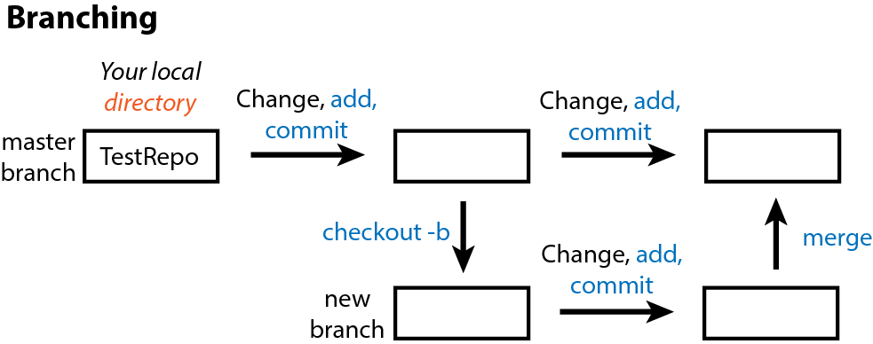

# Reproducible research

## Introduction

In this series, we introduce computational reproducibility and its importance to modern research. We will teach the general principles for reproducible computer-based analyses, along with specific methods and tools for reproducibility with [RStudio](https://www.rstudio.com/). We will also introduce version control with [GitHub](https://github.com/), which is an essential tool in a team environment.

You will learn how to:

* Construct reproducible, automatable workflows in R
* Create reproducible documents using Rmarkdown to include underlying code / computations with relevant graphical and statistical results in several different formats (reports, presentation slides, handouts, notes)
* Use Git version control
* Integrate version control with GitHub for both personal and group projects

This is an intermediate workshop series that assumes prior experience with R (such as that in our [Introduction to R workshop](https://github.com/EDUCE-UBC/workshops_R/tree/main/intro_R_2hr)). 

## Prior to the workshop

### Setup instructions
Please come to the workshop with your laptop setup with the required software and data files as described in our [setup instructions](setup/reproducible_research_setup.html).

### Background

Please read [Hallam SJ *et al*. 2017. Sci Data 4: 170158](https://www.ncbi.nlm.nih.gov/pmc/articles/PMC5663219/) "Monitoring microbial responses to ocean deoxygenation in a model oxygen minimum zone" to learn more about the data used in this workshop. You can also check out this [short video](https://youtu.be/XYQSm2Me86I) showing how the sampling was done!


### Terminology

Reproducibility is purported to be at the heart of science. But what do we mean when we say "reproducible research"? In general, researchers think of replicating an experiment and obtaining the same result (*direct replicability*). However, what we should actually strive for is *true reproduciblity*, reaching the same conclusions through different methods. Moreover, we usually think of the reproducibility of wet lab experiments. It is a somewhat newer movement for researchers to try to make analysis and computational methods reproducible.

In this workshop, what we are really working toward is *repeatability*, the ability to exactly repeat a computational analysis. These methods can then be build upon by other researchers or yourself to find true reproducibility.

## Why reproducibility?

**It helps you remember what you did.**

Your closest collaborator is you 6 months ago. And past you doesn't answer email. ~ Karl Broman, UW-Madison

Even if no other human ever reads your code, it is worth making it reproducible for your future self. It is like a classical lab notebook. You wouldn't expect yourself to remember how many ng of DNA you used in a PCR reaction 2 weeks ago, right? So, you shouldn't expect yourself to remember exact computational workflows.

**It prevents human error.**

If you do anything by hand once, you'll likely do it a hundred times… and five of those times, you'll make a mistake. The easiest way around this is to let a computer complete the repetitive tasks. So, this means you should NOT do anything analysis-related with a mouse (cough Excel cough).

**It helps you communicate with others.**

Past you may be your closest collaborator, but you likely have other people you work with and you probably want to communicate your science to the larger scientific community at some point (#PublishOrPerish). Making your code reproducible makes it accessible to others for their understanding of your research as well as potentially for their use in their own work.

**It is faster.**

This almost goes without saying because a computer can do pretty much anything computational faster than a human. But also, speed comes with repetition. If your code, report, slides, etc. are reproducible, then when you need to make a small change or produce a similar document in the future, that can be done quickly and with minimal effort on your part.

## R projects

One of the most common hurdles to code reproducibility is file paths. If you have all your code and data in `~/Documents` and someone copies it all to their `~/Desktop`, then any links to files in your code will be broken. For example, `read.table(file="~/Documents/mydata.csv")` will not work for the the other person because they do not have that file in that place.

The level 1 solution to this is to start your code by setting the working directory like

```{r eval=FALSE}
setwd("~/Documents")
```

Thus, others need only change this one line of code to be able to use your script.

But we can do one better in R by eliminating the need for any file paths at all with R projects. When you create a project, RStudio creates an `.Rproj` file that links all of your files and outputs to the project directory. When you import data, R automatically looks for the file in the project directory instead of you having to specify a full file path on your computer like `~/Documents`. R also automatically saves any output to the project directory. Finally, projects allow you to save your R environment in `.RData` so that when you close RStudio and then re-open it, you can start right where you left off without re-importing any data or re-calculating any intermediate steps.

RStudio has a simple interface to create and switch between projects, accessed from the button in the top-right corner of the RStudio window. (Labelled "Project: (None)", initially.)

Let's create a project to work in for this workshop. Start by click the "Project" button in the upper right or going to the "File" menu. Select "New Project" and the following will appear.

{width=50%} 
\ 

You can either create a project in an existing directory or make a new directory on your computer - just be sure *you* know where it is.

After your project is created, navigate to its directory using your Finder/File explorer. You will see the `.RProj` file has been created.

To access this project in the future, simply double-click the `.RProj` file and RStudio will open the project or choose File > Open Project from within an already open RStudio window.

## R scripts

The next level of reproducibility in R is to use R scripts. You should never* input commands into the R console because they are not saved there. Instead, input them into an R script and run them from the script. Then, you have a record of all the steps you performed in an analysis.

*Well... not actually never. If you're using R as a fancy calculator, you're probably fine to perform some math in the console. And you likely don't want to save the time you use the help function `?`. But pretty much everything else should go in a script.

Let's practice this.

Create a new R script under File > New File > R script and input the following code

```{r eval=FALSE}
# load packages
## Suite of packages for data manipulation and visualization
library(tidyverse)
# load data from our GitHub
dat <- read.csv("https://raw.githubusercontent.com/EDUCE-UBC/educer/main/data-raw/data_intro_ws.csv")
# create plot of oxygen by depth
O2_plot <- quickplot(data=dat,
     x=O2_uM, 
     y=Depth_m, 
     colour=Season, 
     main="Saanich Inlet: Seasonal oxygen depth profile")
# save the plot
ggsave("O2_plot.png")
```

Save the file under the name "O2_plot.R".

Now we can execute our workflow a couple of different ways. We can:

1. open it in RStudio and run it
2. source it from the R console with `source("O2_plot.R")`
3. run it from the terminal
    - open the terminal (GitBash for Windows users)
    - navigate to your project directory
    - type `Rscript O2_plot.R` and press Enter

If we scripted our workflow right, running the script will produce the `O2_plot.png` file in our project directory. We can re-run it multiple times, (try it after deleting the plot), and it will always recreate the output. Congratulations, you've automated your workflow!

## Modularize by task

Keeping all of our analysis in one file is okay for a small example like this one. However, large analyses should be broken up into multiple scripts, each completing one step (like data cleaning, statistical analysis, plotting, etc.) and **saving the output** to a file on your computer.

Then, you can create a *driver script* that is just a list of `source` commands calling all your individual scripts.

Why go through this extra effort? Modular scripts allow you to:

* run individual steps manually if you need to
* get intermediate results in files that you can look at, save, and share
* execute another tool outside of R for a particular step in your workflow (*e.g.* python, Git, etc.)
* easily replace the driver with a full-blown workflow engine like *Make* (more on this later).

What would this look like for our example? The overall driver script would be

`RootScript.R`
```{r eval=FALSE}
# load in data and packages
source("load.R")
# Create plot
source("plot.R")
```

And the individual step scripts could be

1. `load.R`
    ```{r eval=FALSE}
# load data
dat <- read.csv("https://raw.githubusercontent.com/EDUCE-UBC/educer/main/data-raw/data_intro_ws.csv")
    
write.csv(dat, "data.csv")
    ```

    - Note that we now need to save the data object to our computer with `write.csv` since it needs to be saved somewhere for use in the next script in the workflow.

2. `plot.R`
    ```{r eval=FALSE}
# load packages
# Suite of packages for data manipulation and visualization
library(tidyverse)
# read in data
dat <- read.csv("data.csv")
# create plot of oxygen by depth
O2_plot <- quickplot(data=dat,
                     x=O2_uM, 
                     y=Depth_m, 
                     colour=Season, 
                     main="Saanich Inlet: Seasonal oxygen depth profile")
# save the plot
ggsave("O2_plot.png")
    ```

    - Note that loading of the `tidyverse` package has been moved from the start of our single script to the start of the `plot.R` script. Packages need to be loaded in the script(s) that use them, not all at once in the first script in your workflow.

Now we can run our driver script in the terminal with `Rscript RootScript.R`. This will run first `load.R` then `plot.R`, thus outputting the desired plot. You can easily see how this might scale up when you have dozens of scripts for a project!

## Use *Make*

[*Make*](https://www.gnu.org/software/make/) is an automation tool used to build executable programs and workflows. While it was originally designed to build software (link Linux), it now is widely used to manage projects where you have a number of input files and scripts that create a number of output files.

*Make* is language independent; so, it can work with scripts for any program. 

*Make* is basically just one level more advanced than driver scripts in that is not only runs a list of scripts, it also manages versions of all the associated files and keeps track of dependencies.

1. **_Make_ builds dependencies efficiently.** If an input file hasn't changed since its dependents were built, steps needed to build them don't need to be executed. In contrast, a driver script will run all steps no matter what.
2. **_Make_'s syntax provides a documentation of your project's workflow.** Because you must list dependencies up-front in a Makefile, it's easy to see what depends on what. This may not seem like a big deal in a straight pipeline as the one in our example, but once you have a web or network of dependencies, it's a lot easier to visualize what's going on by representing it this way.
3. **_Make_ is succinct.** *Make* allows expressing dependency patterns (*e.g.* each .PNG file is produced from the data in file X.csv by running `Rscript` on the .R file of the same name), so that you don't have to write out the recipe for building every single plot.
4. **_Make_ easily scales up.** If down the line, you add another plot to the outputs produced by your workflow, and use the same naming scheme, it will get picked up and automatically built the exact same way.

So how do we use Make?

We specify our workflow in a `Makefile` (note the capitalization). Please note that *Make* syntax is not the same as R. Tabs and spaces have very different and particular uses as you will see below. The general `Makefile` formula is below where the **horizontal space before "command" must be a tab**.

```Makefile
target1: dependency1 dependency2 dependencyN
  command --option argument(s)
    
target2: dependency1 dependency2 dependencyN
  command --option argument(s)
```

For our example workflow, the Makefile will look like this. You can make this file in any text editor, though working in the terminal with something like nano, Vmacs, etc. is best to avoid accidental formatting put in place by programs like Word.

```Makefile
all: O2_plot.png

data.csv: load.R
  Rscript load.R

O2_plot.png: data.csv plot.R
  Rscript plot.R
```

Note that if you copy-paste the above, you will need to manually edit the Makefile such that the horizontal spaces before "Rscript" are produced by a tab rather than spaces.

As with scripts, there are several way to execute your Makefile. You can:

1. run it directly in the terminal
    - open the terminal (GitBash for Windows users)
    - navigate to your project directory
    - type `make -f Makefile` and press Enter
        - This runs the make program on your Makefile
2. use a driver script containing the command `system("make -f Makefile")`
    - In this case, you need to use the `system()` function to tell R to run the function in the terminal instead of in R

For the sake of best practices, the later is better since you then have a record of how you executed the Makefile. So update `RootScript.R` with 

```{r eval=FALSE}
system("make -f Makefile")
```

And then execute your updated driver script in the terminal with `Rscript RootScript.R`. This should output the following as it runs through each R script in your Makefile. Voila! The plot appears in your directory.

```
Rscript load.R
Rscript plot.R
── Attaching packages ─────────────────────────────────────── tidyverse 1.2.1 ──
✔ ggplot2 2.2.1     ✔ purrr   0.2.5
✔ tibble  1.4.2     ✔ dplyr   0.7.5
✔ tidyr   0.8.1     ✔ stringr 1.3.1
✔ readr   1.1.1     ✔ forcats 0.3.0
── Conflicts ────────────────────────────────────────── tidyverse_conflicts() ──
✖ dplyr::filter() masks stats::filter()
✖ dplyr::lag()    masks stats::lag()
Saving 7 x 7 in image
```

#### Exercise

1. Alter a script and rerun `make`.
    - Change the plotting script slightly by adding `xlab` and `ylab` to rename the axes. Then, rerun `make` from the terminal.
    - What step(s) get executed?
2. Add to the current workflow with `make`.
    - Create a new script with the same plot now colored by whether or not microbial data exists for each sample (Add_data).
    - Add this script to your Makefile.
    - Rerun `make` to produce both plots at once.
    
*To make sure your code is executing successfully each time, it is best to delete the `.png` files each time so you can easily see the new output.*

## Reproducible R environment with `packrat`

You could be the most detailed and reproducible coder out there but unfortunately, there are often aspects of your workflow that are out of your hands. The most common of these in R is packages. New versions can change functions or even remove them. Parameters change and are added. As a result, your beautiful, reproducible code is bust if someone (including you) tries to use it with the the wrong version of a package.

*In theory*, version numbers should help you keep an eye on this with the general setup of MAJOR.MINOR.PATCH:

* MAJOR version when you make incompatible API changes
* MINOR version when you add functionality in a backwards-compatible manner
* PATCH version when you make backwards-compatible bug fixes

However, not all authors follow this setup religiously and while old R package versions are available on CRAN in the [archive area](http://cran.stat.sfu.ca/src/contrib/Archive), it is tedious to get them.

Fear not! R users realized this issue and developed the `packrat` package to deal with it. In conjunction with an R project, `packrat` records all the packages and versions used in that project. It also creates a private package library for the project, in which it will install a copy of all the required packages so that your projects are completely isolated from each other, even if they use mutually incompatible versions of other packages. As you continue to work on a project and perhaps use additional packages, update packages you are already using, or remove the need for a given package, `packrat` keeps track of all this to keep the project's private library up-to-date and as small as possible.

In general, it is not necessary to initiate `packrat` while you are actively working on a project on your own (since you know whether or not your code works on your machine with your versions of everything). However, it can be useful to use it right from the start if you are actively collaborating with others. Once you've installed the `packrat` package, you have the option to initiate it when you make a New Project.

{width=50%}

Otherwise, you an initiate `packrat` in an existing project like so.

```{r eval=FALSE}
# Package version control
library(packrat)

packrat::init()
```

For those who are unfamiliar with R's `::` syntax, this allows you to call functions from a specific package. It is required when more than one package uses the exact same name for a function. In this case, we use it to specify that we want R to use the `init` function from `packrat` as opposed to `init` from Git.

*Your console may print out a bunch of errors about fontspec and typesetting engine if you initiate packrat from a project with Rmarkdown. This is a current issue with latex in R and can be ignored at this time.*

As you work on your project, you can check whether your current project matches all the versions in your saved `packrat` library,

```{r eval=FALSE}
packrat::status()
```

Update the library with new packages or versions as needed,

```{r eval=FALSE}
packrat::snapshot()
```

Or remove unneeded packages from the library.

```{r eval=FALSE}
packrat::clean()
```

`packrat` also provides functions for "bundling" up your project and all its dependencies into a single file, which can be copied to another computer and "unbundled", instantly reproducing your environment on a new machine. 

```{r eval=FALSE}
packrat::bundle()
  
packrat::unbundle()
```

Of note, most of these functions can also be done from the `packrat` menu that appears in the Packages tab in the lower right quadrant of RStudio.

While we're on the topic of versions, you also need to record the version of R as well as your current computing platform (operating system and hardware architecture) to ensure reproducibility. You can easily print all this information in R with `sessionInfo()`.

## Documents made reproducible

### What is a document really?
There are two main aspects of creating a document: **content and appearance**. These two features are bundled together in a markup language, so-called because authors used to "mark up" physical documents with instructions on how to display the various parts *e.g.* title size, indentations, justification, etc.

We don't often think about these as two separate things as it is customary to simultaneously create both with programs like MS Word and PowerPoint where the markup language is hidden behind GUI features and buttons. However, in the background, what you always have is a **source file** with content and instructions for appearance that can be rendered into a **viewable document**. Think of the source file as a pie recipe with ingredients list while the viewable document is the pie that results from following that recipe. 

To be reproducible, you should setup your files such that you only need to modify the source file and re-render to change the viewable document. This is not possible with programs like Word because you never truly see the source file. Moreover, if you have inserted static content like figures, you'd need to go into another program to edit those and re-paste them into the source file. Not very reproducible at all!

So, we will explore tools for creating this source file! Some powerful markup languages for developing source files are:

- LaTeX (through beamer) for PDF or slides
- Mark*down* (not *up*) for PDF, HTML, or slides

We will focus on markdown (`.md`) as it pertains to reproducible workflows in R.

### Rmarkdown

[Markdown](https://daringfireball.net/projects/markdown/) itself (outside of R) is a flexible language for creating source documents. It is simple to learn, easy to read, and very widely used. [Rmarkdown](https://rmarkdown.rstudio.com/) (`.Rmd`) is merely markdown with a few added features used in RStudio. 

Rmarkdown can be rendered to the following viewable document types. This is done using the `knitr` package with the Knit button in the upper left quadrant menu bar.

- `html_document`
- `word_document`
- `pdf_document` (requires LaTeX)
- `ioslides_presentation`: slides using HTML
- `beamer_presentation`: PDF slides (requires LaTeX)

In Rmd, you have the **header** and the **body**. 

- header: overall document settings in a language called YAML (one of the added features of `.Rmd` as compared to `.md`)
- body: content and appearance instructions in markdown

***

If you are attending a 3 x 2-hour workshop, this is the end of day 1

***

#### YAML header
Let's create a new Rmarkdown document (File > New File > R Markdown...). Leaving the defaults (document, html output), our `.Rmd` file is already populated with a minimal YAML header like below.

```
---
title: "Untitled"
author: "Your Name"
date: '2018-06-22'
output: html_document
---
```

The header must be at the start of the document and be encased by `---`. As you can see, the basic YAML syntax is `appearanceInfo: content`. 

You can expand the header to customize your rendered document's appearance. For example, here is the header for this notes document.

```{}
---
title: "Reproducible research"
author: "Kim Dill-McFarland"
date: "version `r format(Sys.time(), '%B %d, %Y')`"
output:
  html_document:
    toc: yes
    toc_float:
      collapsed: no
  pdf_document:
    toc: yes
    latex_engine: xelatex
---
```

There are a few things here that you may find useful in your future reports. 

1. The `date` section is filed in with dynamic code that will automatically access your computer and input the current date in the format "version month day, year".
2. There is information for rendering in either html or pdf formats, though only the one on top will be rendered each time.
3. Under the html format, we have specified that we want a table of contents (`toc`) that floats as you scroll through the rendered html document and does not collapse into only high level headings.
4. Under the pdf format, we have also specified to use a table of contents, though floating and collapsing are not options in this format. In addition, we've changed the rendering language to be `xelatex` as opposed to the default `pdflatex`. In this case, we did this to make `packrat` work with Rmd.

#### Exercise: YAML 

In your new `.Rmd`, replace the automatically populated header and contents with the following. Don't worry about the contents of the body yet; we'll go over that next.

```{}
---
title: "Learning Rmarkdown"
author: "Your Name"
date: "version `r format(Sys.time(), '%B %d, %Y')`"
output:
  html_document:
    toc: yes
    toc_float:
      collapsed: no
  pdf_document:
    toc: yes
    latex_engine: xelatex
---

# Header 1

## Subheading 1A

# Header 2

## Subheading 2A

## Subheading 2B
```

1. In the `date` section, play around with capital versus lowercase letters in the `'%B %d, %Y'` portion. Try to get the date in the format MO/DY/YR when you render (knit) the document.
2. Change `toc_float: collapsed: no` to `toc_float: yes`. What happens to the table of contents?
3. Remove `toc_float: collapsed: no`. What happens to the table of contents?
4. Change `toc: yes` to `toc: no`. What happens to the table of contents?


### Knitting

To render your `.Rmd`, that is to take all the appearance and content information in the *source* file (`.Rmd`) and make the *viewable* document (`html`, `PDF`, etc.), you use `knitr` in R. This is most commonly done by clicking the "Knit" button with the blue ball of yarn in the menu above your file window (upper right quadrant). 

Note: The first time you knit a document, RStudio will prompt you to install several packages.

### Markdown body

#### Headings and Subheadings
The body of Rmd is organized by headings with `#`. The more `#` in a row there are, the farther in and smaller a heading will be. By default, only down to `###` are shown in the table of contents.

#### Vertical spacing
Headings automatically get vertical spaces around them. In your other content, you can separate 2 paragraphs with a *half* pt space with **double spaces** at the end of the first paragraph. Or you can separate with with a *full* pt space with **2 hard returns** at the end of the first paragraph. 

This is separated  
by double spaces while this is separated

by 2 hard returns.

Note that a **single hard return** is simply treated as a space and the two paragraphs will run together.

#### Text/font
`*italics*` or `_italics_`  
`**bold**` or `__bold__`

`superscript^2^`  
`subscript~2~`

`~~strikethrough~~`

``looks like code``

#### Links
To websites:  
`[link](www.rstudio.com)`

To local images:  
``

To web images:  
``

#### Lists

```
* unordered list
* item 2
  + sub-item 1
  + sub-item 2
```
```
1. ordered list
2. item 2
  + sub-item 1
  + sub-item 2
```

#### Formulae

Use `$` to denote formulas. Inline formulas are surrounded by single `$` while new line formulas use `$$`.

`$a_1^2 + a_2^2 = a_3^2$` gets typeset to $a_1^2 + a_2^2 = a_3^2$.

`$$ \bar{x} = \frac{1}{n} \sum_{i=1}^n x_i $$` gets typeset as $$ \bar{x} = \frac{1}{n} \sum_{i=1}^n x_i $$

For more math symbols, see [here](http://csrgxtu.github.io/2015/03/20/Writing-Mathematic-Fomulars-in-Markdown/).

### Static documents 
All that we've gone over thus far contributes to Rmd static documents, or those that don't change every time you render them. For example, [our workshops README](https://github.com/EDUCE-UBC/workshops/blob/main/README.md) is in md and is simply a collection of text and `.png` images. There is no real "code" so-to-speak.

It may seem silly to write static documents in markdown if you're already familiar with programs like MS Word. However, as you will see when we get to Git, there are some distinct advantages to markdown when it comes to version control. More on this later!

#### At home exercise: Rmarkdown

1. Convert your notes from this workshop into an `.Rmd`.
    - Try use use headings, bold/italic, links, etc.

### Dynamic documents 

The true power of Rmd for reproducible research comes with *dynamic* documents. These not only contain static content like text and images but also code chunks that run R code (and other languages) and display the outputs, be they descriptive, statistical, graphical, etc.

This means you don't need to copy-paste your analysis results into a document for reporting. No more fiddling with Excel graphs pasted into Word! No more completely remaking reports from scratch! No more collaborators asking how *exactly* you made that figure!

Some people even write their entire thesis in markdown, so anything is possible!

#### Code chunks

An R code chunk is formatted as

    `r ''````{r}
    Your
    code
    here
    ```

For example, we can read in the data and packages for this workshop in our Rmarkdown file with

    `r ''````{r}
    # load packages
    ## Suite of packages for data manipulation and visualization
    library(tidyverse)

    # load data
    dat <- read.csv("https://raw.githubusercontent.com/EDUCE-UBC/educer/main/data-raw/data_intro_ws.csv")
    ```

```{r echo=FALSE, message=FALSE, warning=FALSE}
#Actually read in the data for Rmd
# load packages
## Suite of packages for data manipulation and visualization
library(tidyverse)

# load data
dat <- read.csv("https://raw.githubusercontent.com/EDUCE-UBC/educer/main/data-raw/data_intro_ws.csv")
```

Chunks have lots of [customizable options](https://yihui.name/knitr/options/) that impact how their output looks in the rendered document like whether or not to show the underlying R code or warnings or messages, figure size, etc.

You can also use other languages in code chunks. For example, python scripts can be inserted and run directly in an Rmarkdown by creating the corresponding chunk.

    `r ''````{python}
    Your
    code
    here
    ```

As of 2018, R supports chunks in Bash, python, Rcpp, SQL, and Stan.

#### Inline code

Small bits of code can also be placed inline with

    `r '\x60r your code here\x60'`

For example, you many be writing an abstract and want to state

> "We obtained geochemical data for X samples, Y of which had corresponding microbial data." 

You could fill in the numbers yourself but what if you get more data later on? What if you remove samples that upon preliminary analysis, are not high enough quality? Well, then you'd have to go back and edit your abstract by-hand.

Or markdown could do it for you! With the data we used previously in this workshop, you could instead write

> "We obtained geochemical data for `nrow(dat)` samples, `nrow(filter(dat, Add_data==TRUE))` of which had corresponding microbial data."

which renders to

> "We obtained geochemical data for `r nrow(dat)` samples, `r nrow(filter(dat, Add_data==TRUE))` of which had corresponding microbial data."

Now if you change the number of samples in the data frame with all your samples (`dat`), your abstract will fix itself with a simple re-render.

#### Exercise: dynamic Rmd

1. Create a new `.Rmd` and replicate part of our Introduction to R workshop found in the `dynamic_R_challenge.html` document provided.

***

If you are attending a 2 x 3-hour workshop, this is the end of day 1

***

### Slides made reproducible

Slides can also be created in `.md/.Rmd` either as static documents or with dynamic code. The formatting in the body is the same **except**

* each header `##` indicates a new slide
* lists can be revealed incrementally using `> -` for bullets

There are several [rendering options](https://rmarkdown.rstudio.com/lesson-11.html) for Rmd slides with [examples](https://rmarkdown.rstudio.com/gallery.html) of the default appearances. It is quite difficult to change the overall look of markdown slides so it is best to pick a render package that is near the look you want. You can specify your render package of choice as the `output` in the YAML header of the `.Rmd`.

```
---
title:
author:
date:
output: ioslides_presentation
---
```

As the syntax of slides is the same as documents, we will not go into detail during this workshop but checkout the slides `.Rmd` in the workshop material to see how slides were made for this workshop!

#### At home exercise: Slides

1. The next time you have to give lab meeting, present in a class, lead a discussion, etc., try making your slides in Rmd. Once you get some practice, it take no more time than PowerPoint!

### Rmd in your workflow

To incorporate Rmd into your reproducible workflow, you can render an `.Rmd` document in your *Make* file with `rmarkdown::render("input_file.Rmd")`.

### Publish with Rpubs.com

[Rpubs.com](http://rpubs.com/) is a free online service from RStudio that let's you put your Rmarkdown documents online with a push of the button. After you register online, you can simply click the "Publish" button (blue dot with 2 blue curves around it) in the upper right corner of the toolbar for your markdown document in RStudio. This sends the rendered html to the site. For some examples, see [here](http://rpubs.com/dillmcfarlan).

## Git

### What is version control?

Version control is any means of recording changes to file(s) over time so that you can recall or revert back to specific versions later.

One method of version control you may have employed in the past is dated or versioned file names like `myFile_2018.06.25.txt` or `myFile_v1.2.txt`. While these systems can get the job done, you end up will a long list of files that take up storage space and have little information on how they differ. It remains up to you to remember or tell someone what date or version to go back to for whatever purpose is needed. 

And heaven forbid you stamp a file with `final`!


### Why Git?

There is a better way to version control with distributed systems, and [Git](https://git-scm.com/) is one such language/program. While Git can be used to track changes for any file type, it is most useful with text-based files like `.txt`, `.Rmd`, `.R`, etc. because these are *source files* with the appearance directions clearly noted and not hidden behind a GUI. Think of Git like the "track changes" feature of MS Word, except there is a record of the changes after you "accept" them.

The advantages of distributed version control over naming methods are that:

- it is easy to see what changed when (time-stamped), why (commented), and by whom (author identified)
- you can jump back to any point in time since the file's creation, not just versions you deemed important enough to save at the time
- you have the freedom to experiment, try something crazy even, because you can always go back to the last known good version
- you can work on 2+ different versions in parallel
- you are able manage contributions from multiple people (see later section on GitHub)

Specifically, we are using Git, as opposed to another program, because it:

- is very fast, even for projects with hundreds of files and years of history
- doesn't require access to a server
- is already extremely popular

## Git on your computer 

All Git functions are accessed from the command line with `git` followed by the function name like `git init`. You do not need to open a specific program other than your terminal. The commands used in this section are summarized in the following infographic. Please refer to it as we progress through the examples.


### Initialize a repo (`git init`)

Git will not implement version control on your files until you tell it to do so. This is accomplished by initializing a repository with `init`.

First, create a directory on your desktop named `TestRepo`. Then, open your terminal/GitBash, navigate to the `TestRepo` directory, and initialize it as a repo with 

```
git init
```
You should see an output similar to the following showing that Git knows this directory is a repo.

```
Initialized empty Git repository in /Users/kim/Desktop/TestRepo/.git/
```

If you now list all the files in the `TestRepo` directory with `ls -a`, you will see a `.git` file that designates that this directory is a Git repo. Nothing about the directory itself has changed; Git just now knows to track it for version control.

### Add files (`git add`)

Create a `README.md` using a text editor of your choice and include the following as the contents of this file.

```
This is a README for my first Git repo.
```

Now that we've added a file, we can query if there are any differences between our local `TestRepo` directory and the version controlled repo with 

```
git status
```

```
On branch main

No commits yet

Untracked files:
  (use "git add <file>..." to include in what will be committed)

  README.md
  
nothing added to commit but untracked files present (use "git add" to track)
```

We see that `README.md` simply being in a repo does not automatically tell Git to track this file; it remains "untracked". So, we must add the file to Git tracking. We can either add just this file specifically with

```
git add README.md
```

Or if we had more than 1 file to add at once, we could add all with

```
git add .
```

Now we see with `git status` that our README is tracked but not committed.

```
On branch main

No commits yet

Changes to be committed:
  (use "git rm --cached <file>..." to unstage)

	new file:   README.md
```

### Git staging area (index)
If the file is tracked but not committed (*i.e.* version saved), where is it? Well, Git has a staging area (also called the index) where a version of a file is stored prior to it being more permanently saved as a committed version. 

This is useful because sometimes you may want to:

* save a version as a back-up in the short-term but do not want to permanently save that version in the long-term
* complete many small changes separately but save them all together as 1 new version
* compare your current version with the last committed version without causing any conflicts in your repo

### Commit changes (`git commit`)

Once you have a version you want to save for all time, you need to `commit` it from the index to the repo. It is best practices to include a message with each commit using `git commit -m "Your message here"`. You wouldn't believe the number of commits with a message simply of "typo"! We will use the following to commit our first version of `TestRepo` with the README.

```
git commit -m "Initialize README"
```
 
```
[main (root-commit) 151a8dc] Initilaize README
 1 file changed, 1 insertion(+)
 create mode 100644 README.md
```

You receive a summary of how many files were changed and what those changes where (though exact ID numbers will be specific to your repo).

Now with `git status`, we see that our local directory, index, and repo are all identical.

```
On branch main
nothing to commit, working tree clean
```

#### Exercise: Git add and commit

1. Change a file and commit the new version.
  - Add the following to your `README.md` file, where you fill in your name.
    ```
  My name is Kim Dill-McFarland.  
    ```
  - Using a combination of `git status, add, and commit`, determine if your version matches your repo and commit the new version *with a comment* as needed.
  - Note the messages Git outputs in the terminal as you complete each step. They are very informative and helpful!

### Comapre versions (`git status` and `diff`)

Since we are working with a single, small file in a small repo, it is easy to remember what versions are where. However, as you make larger files and repos, sometimes you will not know this. So, Git has functions for comparing versions.


Your `git status` should be up-to-date after the previous exercise. Now let's create some differing versions in our local, index, and repo.

Add your birthday to `README.md` and `git add .` this change *but do not commit*. Then add your favorite color and *do not add or commit* this change. So, now we have versions the following versions.

* local: name, birthday, color
* index: name, birthday
* repo: name

We can determine what version is where with various parameters in `git diff`. Added lines are indicated by +, deleted lines by -, and changed lines by showing both versions inline.

* `git diff`: local vs. index
    ```
 This is a README for my first Git repo.
 My name is Kim Dill-McFarland.
 My birthday is Nov 29.
+My favorite color is purple.
    ```
* `git diff --cached HEAD`: index vs. repo 
    ```
 This is a README for my first Git repo.
 My name is Kim Dill-McFarland.
+My birthday is Nov 29.    
    ```
* `git diff HEAD`: local vs. repo
    ```
 This is a README for my first Git repo.
 My name is Kim Dill-McFarland.
+My birthday is Nov 29.
+My favorite color is purple.
    ```

And so if you are unsure which version you are using (local) or which one you want to revert to, `diff` can show you.

### Past commits (`git log` and `show`)

You'll notice in the `diff` commands referencing the repo, it is referred to as HEAD. This is the most recent commit version in the repo and you can go back farther with `HEAD~##`.

Let's `add and commit` our current changes so that we have multiple commits to look at. Since we never committed the version with only the birthday added, this version is lost with a new `git add`.

We can see all past commits in this repo with

```
git log
```

```
commit 0eafc7f9ac7b1f9adb239e730aead874a7888854 (HEAD -> main)
Author: Kim Dill-McFarland <kdillmcfarland@gmail.com>
Date:   Tue Jun 26 14:46:42 2018 -0700

    Add birthday and fav color

commit d4f6f1869c9846ba1809e58e3c5608af79383549
Author: Kim Dill-McFarland <kdillmcfarland@gmail.com>
Date:   Tue Jun 26 14:28:23 2018 -0700

    Add name

commit a2f0948cd60b3c1e17aaaf45fad966cf924e085d
Author: Kim Dill-McFarland <kdillmcfarland@gmail.com>
Date:   Tue Jun 26 14:27:02 2018 -0700

    Initialize README
```

Or view a specific past version using `HEAD~##`. For example, we can view our first commit which is `HEAD~2`

```
git show HEAD~2
```

```
Author: Kim Dill-McFarland <kdillmcfarland@gmail.com>
Date:   Tue Jun 26 14:27:02 2018 -0700

    Initialize README

diff --git a/README.md b/README.md
new file mode 100644
index 0000000..862c717
--- /dev/null
+++ b/README.md
@@ -0,0 +1 @@
+This is a README for my first Git repo.
```

### Branches (`git checkout -b`)


One of the best ways to avoid the need to undo anything in Git is to use branches. These are copies of your repo that you can work on independently of the "main" without impacting the main but still version control changes as you go. You can then choose to merge the branch with the main if you want to keep those changes or abandon the branch and go back the to the main if you do not want to keep those changes.

You may have noticed that many of our previous Git outputs start with `On branch main`. This is because by default, we were working on the main branch of the project (the only branch up to this point).

Branches are particularly useful to:

* test new features without breaking the current working code
* collaborate in parallel
* follow a risky idea that has the potential to break your working code
* develop the same base code into 2+ other applications

To start a new branch, first make sure that everything is up-to-date with `git status`. Then, `checkout` or create and move into a new branch using the branch `-b` parameter.

```
git checkout -b new_branch main
```

With `git status`, we see that we are in the new branch.

```
On branch new_branch
nothing to commit, working tree clean
```

Now we can make changes in this branch without impacting the main branch. Go ahead and edit `README.md` and pick a new favorite color. Then `add and commit` this change in your new_branch.

The two branches no longer match so we must merge them and decide which version(s) to keep. To do so, we must

1. Move back into the main branch `git checkout main`
2. Merge the branches `git merge new_branch` which overwrites the older main branch with our new changes in the new_branch

### Merge conflicts (`git merge`)

Merging works simply if only 1 of the branches being merged has be altered since it branched off. If both branches contain non-synonymous changes, there will be a conflict.

You resolve a conflicts by merging, opening the file(s) with conflict(s), editing until you have the version you want, and saving the new, correct merged version with `add and commit`.

#### Exercise: branches and conflicts

1. Create a new_branch2 (since new_branch was already merged into main).
2. Edit `README.md` in new_branch2 by adding your middle name. Add and commit to this branch.
3. Edit `README.md` in main by removing your last name. Add and commit to this branch.
4. Merge main and new_branch2.
5. Open `README.md` and look for markers `<<<<<<`, `=======`, and `>>>>>>` to denote conflicts.
6. Edit to your name of choice, making sure to remove the markers.
7. Add and commit to main.

Conflict solved!

### Summary of Git

Thus far, we have covered the main Git terms and functions that you will need to enact version control on your own computer (summarized below).

#### Terms

- **Repository**: the contents (directory/folder) of a project including all history and versions for all files in that project
- **Commit**: a snapshot of the state of the repository at a given point in time including the author, time, and a comment
- **Staging/Index**: files marked for inclusion in the next commit as whatever version that they were *at the time they were staged*, not necessarily the most up-to-date version on your computer
- **Branch**: a named sequence of commits kept separate from the original "main" sequence
- **Merge**: including changes from one branch into another
- **Conflict**: parallel changes to the same section(s) of a file that can't be automatically merged

#### Commands

* `status`: query for differences in versions in local, index, or repo
* `init`: initialize a repo
* `add`: add files to the index (staging) prior to committing
* `commit -m`: save changes in the index as a time-stamped version with comment (message)
* `diff (HEAD) (--cached HEAD)`: compare file versions in the local vs. index (local vs. repo) (index vs. repo)
* `log`: show list of previous commits in the current repo
* `show`: show a detail account of a previous commit
* `checkout`: create and move between branches or the local, index, and repo
    - Not shown here but `checkout HEAD` can be used to move to a past commit and re-instate file versions from that commit
* `merge`: combine changes from a branch into the main repo (may result in conflicts)

To checkout more functionalities in Git, see a [list of all Git commands](https://git-scm.com/docs).

## Collaborate with GitHub

[GitHub](https://github.com/) is a web service for hosting Git repositories - content and version history. It has web and GUI interfaces as well as many tools for facilitating collaboration within repos.


Similar to our decision to use Git, GitHub finds much of its strength in that is is widely popular and easy to use. If you make the choice to use Git, then GitHub is the natural choice for hosting and collaboration.

### Configure your computer (`git config`)

Prior to this workshop, you should have signed-up for a free GitHub account. You now need to link your computer to your GitHub account using the email from this account and whatever name you want stamped on your commits. This need only be done once on your computer.

```
git config --global user.name "Your Name"

git config --global user.email "youremail@email.com"
```

### Make an online repo

Next we will make an online GitHub repo to link our local repo to. In a browser, navigate to your [GitHub](https://github.com/) account homepage and click "New repository".

{width=50%}

Name the repo `TestRepo` and create it. GitHub then gives you the URL for this repo. 


### Link local and online repo (`git remote`)

Finally, we will link our TestRepo to the online GitHub repo using the URL provided.

You link it to your local directory and repo by using *your specific repo URL* in the following command in your terminal. Make sure your terminal is still pointing at the correct directory!

```
git remote add origin https://remote_repository_URL
```

### Update an online repo (`git push`)
If no errors occur, you can now upload your local repo to GitHub with `push`. The first time you push, you need to specify to GitHub that you are pushing from the main repo.

```
git push -u origin main
```

All subsequent push commands for this repo can simply be

```
git push
```

If you go back to your browser and refresh your page, you should now see `README.md` in your online repo.

Once your local repo is fully linked with its online GitHub repo, you can go about version control as you normally would (change files > add > commit). When you have a committed version of the repo that you want to backup or share to GitHub, you `git push`.

### Copy an online repo (`git clone`)

If you are the only one working on your repo and only work on it from 1 computer, then GitHub acts as a one-way street. You push things there for storage, sharing, etc. and should only need to pull them back down if something terrible happens to your computer.

However, GitHub also allows work on a repo from multiple computers and by multiple different users. You or others can copy an online GitHub repo to your computer with 

```
git clone URL.of.the.repo
```

### Update from online repo (`git fetch` and `pull`)

Now when you have multiple copies of a repo potentially being worked on and `push`ed to GitHub from multiple computers or people, the version on GitHub may be more up-to-date than the one you have on the computer you happen to currently be working on.

To update you local repo from GitHub, you must go through a staging area (index) similar to the one in-between your local directory and repo. You can place GitHub content in this index with

```
git fetch
```

And use `git status` to compare your local and GitHub versions. Then, if you decide you want to update your local version, you reverse push with

```
git pull
```

#### exercise: multiple repo users

Now we will similate what is would be like to collaborate on the same repo with another person.

In pairs:

1. UserA: Use `git clone` to copy the `TestRepo` from UserB.
2. UserB: Make a change to `README.md` in your repo on your own computer and `push` that change to your GitHub.
3. UserA: Update your copy of UserB's repo.
4. Switch roles!


### GitHub GUI
After all this command line work, we now reveal to you that you can use Git in [GUI form](https://desktop.github.com/). While the GUI is useful for simple `commit, push, pull` activities, some functions (like hard resets, undos, etc.) are still only available via command line. We encourage you to explore both the command line and GUI forms of Git as you practice.

You can explore all the repos on your computer,

{width=50%}

see specific changes to text based files,


and add, commit, push from the GUI.

{width=50%}

### Git in RStudio

Working in an R project in a directory that is also a Git repo will reveal a Git tab in the upper right quadrant of RStudio.

To see this, close and then move your workshop project directory into your `TestRepo`. Re-open the project (from `.Rproj`) and navigate to this Git tab.

You will see that similar to the GitHub GUI you can see `diff` and `commit` changes directly from RStudio as well as see a summary (M: modify, D: delete, ?: add) of changes in the project since your last commit.

{width=75%}

## Additional resources

### Reproducible research
- [Software Carpentry](https://software-carpentry.org/lessons/) including lessons on Git, Rmd, and reproducible research
- [Riffomonas](http://www.riffomonas.org/) including reproducible research methods in R

### R/RStudio
- [packrat tutorial](https://rstudio.github.io/packrat/walkthrough.html)
- [Rmarkdown cheatsheet](https://www.rstudio.com/wp-content/uploads/2015/02/rmarkdown-cheatsheet.pdf)
- [Rmarkdown tutorials](https://rmarkdown.rstudio.com/lesson-1.html)
- [Git in RStudio](http://r-bio.github.io/intro-git-rstudio/)

### Git/GitHub
- [Git cheatsheet](https://gist.github.com/davfre/8313299)
- [List of all Git commands](https://git-scm.com/docs)
- [Git tutorial](https://git-scm.com/docs/gittutorial)
- [Git Pro EBook](https://git-scm.com/book/en/v2)
- [Git help](https://help.github.com/)
- [Build a web site from a repo!](https://pages.github.com/)
- Explore [private repositories](https://github.com/pricing) and [organizations](https://help.github.com/articles/about-organizations/)

## Survey 

Please provide us with feedback through this [short survey](https://ubc.ca1.qualtrics.com/jfe/form/SV_2tOcP5OKnCNyauV).
