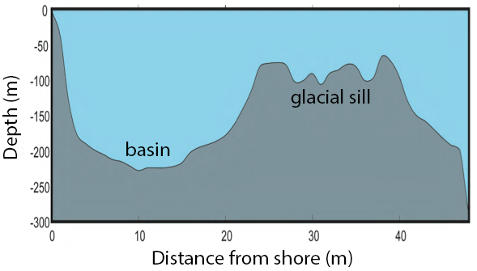

# Intermediate R programming

## Introduction

In this workshop, you will learn to use R as a programming environment, allowing you to write more complex, yet clearer data analysis code. We will teach you three fundamental concepts of R programming: classes, functions, and packages.

You will learn how to:

* access specific parts of an object and its attributes,
* use different classes of objects in generic R functions,
* create your own generic functions,
* structure a package and package libraries, and
* create your own package and distribute it to other R users.

This is an intermediate workshop series that assumes prior experience with R (such as that in our [Introduction to R workshop](https://github.com/EDUCE-UBC/workshops_R/tree/main/intro_R_2hr)). 

### Setup instructions

Please come to the workshop with your laptop setup with the required software and data files as described in our [setup instructions](setup/intermediate/intermedR_setup.html).

### Background 

Please read [Hallam SJ *et al*. 2017. Sci Data 4: 170158](https://www.ncbi.nlm.nih.gov/pmc/articles/PMC5663219/) "Monitoring microbial responses to ocean deoxygenation in a model oxygen minimum zone" to learn more about the data used in this workshop. You can also check out this [short video](https://youtu.be/XYQSm2Me86I) showing how the sampling was done!

### Data description

The data in this workshop were collected as part of an on-going oceanographic time series program in Saanich Inlet, a seasonally anoxic fjord on the East coast of Vancouver Island, British Columbia (Figure 1). 

<br>
<br>
{width=4in}
/ 

**Figure 1.** Map of Saanich Inlet indicating conventional sample collection stations (S1-S9). Data used in this workshop is sourced from S3.
<br>
<br>

Saanich Inlet is a steep sided fjord characterized by a shallow glacial sill located at the mouth of the inlet that restricts circulation in basin waters below 100 m (Figure 2).

<br>
<br>

/ 

**Figure 2.** Structure of Saanich Inlet. The glacial sill restricts water circulation into and out of the lower depth of the inlet basin.
<br>
<br>

During spring and summer months, elevated primary production (like photosynthesis) in surface waters combined with restricted circulation results in progressive water column stratification and complete oxygen starvation (anoxia) in deep basin waters. In late summer, pulses of oxygenated nutrient-rich ocean waters upwelling from the Haro Straight cascade over the sill, displacing oxygen starved bottom waters upward. The intensity of these renewal events varies from year to year with implications for microbial ecology and biogeochemical cycles (Figure 3). 

<br>
<br>

/ 

**Figure 3.** Contour plot of water column oxygen concentrations over multiple years in the time series. Warmer colors indicate high oxygen concentrations while cooler colors are low. Note the recurring pattern of oxygen decline below 100 m depth intervals followed by seasonal renewal events in late Summer into early Fall carrying more oxygenated waters into the Inlet. 
<br>
<br>

The seasonal cycle of stratification and deep water renewal enables spatial and temporal profiling across a wide range of water column energy states and nutrients, thus making Saanich Inlet a model ecosystem for studying microbial community responses to ocean deoxygenation. Ocean deoxygenation is a widespread phenomenon currently increasing due to climate change. 

The data we will use in this workshop include various geochemical measurements at many depths in Saanich Inlet. Samples were taken approximately monthly from 2006 to 2014, though there is much missing data to contend with.

For a brief introduction to the data used in this workshop series, see [Hallam SJ *et al*. 2017. Sci Data 4: 170158](https://www.ncbi.nlm.nih.gov/pmc/articles/PMC5663219/) "Monitoring microbial responses to ocean deoxygenation in a model oxygen minimum zone". More detailed information on the environmental context and time series data can be found in [Torres-Beltrán M *et al*. 2017. Sci Data 4: 170159.](https://www.nature.com/articles/sdata2017159) "A compendium of geochemical information from the Saanich Inlet water column".

### Making an RStudio project

Projects allow you to divide your work into self-contained contexts. 

Let's create a project to work in.

In the top-right corner of your RStudio window, click the "Project: (None)" button to show the projects dropdown menu. Select "New Project..." > "New Directory" > "New Project." Under directory name, input "intermediate_R" and choose a parent directory to contain this project on your computer.

### Installing and loading packages

At the beginning of every R script, you should have a dedicated space for loading R packages. R packages allow any R user to code reproducible functions and share them with the R community. Packages exist for anything ranging from microbial ecology to complex graphics to multivariate modeling and beyond. 

In this workshop, we will use several packages within the [tidyverse](https://www.tidyverse.org/) as well as several development tools listed below.

Here, we load the necessary packages which *must already be installed* (see [setup instructions](setup/intermedR_setup.html) for details).

```{r, message=FALSE, warning=FALSE}
library(tidyverse) # Easily Install and Load the 'Tidyverse'
library(lmerTest) # Tests in Linear Mixed Effects Models
library(devtools) # Tools to Make Developing R Packages Easier
library(roxygen2) # In-Line Documentation for R
library(testthat) # Unit Testing for R
library(usethis) # Automate Package and Project Setup
```

### Downloading data

The following command downloads the data from our [GitHub](https://github.com/EDUCE-UBC/workshops_access) and since you're working in a Project, saves it in the Project directory under the `data` directory on your computer.

```{r}
write.csv(
  read.csv("https://raw.githubusercontent.com/EDUCE-UBC/educer/main/data-raw/data_intermediate_ws.csv"),
  "data/Saanich_Data_clean.csv", row.names=FALSE)
```

### Load data

Let's start by reading in the data we will use for this workshop. Here, we specify that the data file is named "Saanich_Data_clean.csv". Furthermore, we specify that the first row of the data contain variable names, and that empty, NA, NAN, or ND values should be treated by R as missing data (coded in R as NA). 

```{r}
dat <- read_csv(file="data/Saanich_Data_clean.csv",
                     col_names=TRUE,
                     na=c("", "NA", "NAN", "ND"))
```

*If you would like to learn more about how these data were cleaned and manipulated, please see our [R tidyverse workshop](https://github.com/EDUCE-UBC/workshops_R/tree/main/intro_tidyverse).*

## Objects, classes, and attributes

Practically speaking, everything you encounter in R is an object.

* Everything your store in your work-space is an object.
* Built-in functions are objects.
* Data sets are objects.
* ggplot2 graphics are objects (base R graphics are not).

Every object has a **class**, and many objects have **attributes**. You can use the `class` function to determine an objects class and the `attributes` function to see its attributes.

## S3 objects

### Vectors
Vectors are the most common type of object in R. In fact, a scalar is a vector of length 1, and matrix is a vector of vectors! Once you store a vector in your R environment, you have created an R object and...

* Every object has a mode and storage mode.
* Vectors have an inherent class based on their mode.

There are 5 data types that are stored in basic (atomic) vectors

**class** |	**mode** |	**storage.mode**
----------|-----------|-------------------
numeric |  numeric | double
integer |  numeric | integer
character | character | character
logical | logical	| logical
complex | varies | varies

#### Numeric
```{r}
x <- 1
class(x)
mode(x)
```

#### Integer
```{r}
x <- 1L
class(x)
mode(x)
```

#### Character
```{r}
x <- "1L"
class(x)
mode(x)
```

#### Logical
```{r}
x <- TRUE
class(x)
mode(x)
```

#### Matrix (complex)
```{r}
x <- c(1,1)
dim(x) <- c(2,1)
class(x)
mode(x)
attributes(x)
```

#### Exercise: Working with vectors

1. Assign x the value `"a"`. What are its class and mode?
2. Give it dimensions `c(1,1)`. What are its class and mode?

### Complex objects

Complex objects can be vectors at heart (like the matrix above) but not all are. Since everything in R is an object, you can determine the class and attributes of pretty much anything in R.

#### Built in functions

```{r}
class
class(class)
attributes(class)
```

#### Graphics 

```{r warning=FALSE}
p1 <- dat %>% 
  ggplot(aes(x=O2_uM, y=Depth_m)) +
  geom_point() +
  geom_smooth(method="lm") + 
  scale_y_reverse(limits=c(200, 0)) +
  labs(x=expression(O[2]*" "*(mu*g/mL)),
       y="Depth (m)", 
       title="Oxygen decreases with depth and is less variable at lower depths")

p1
class(p1)
attributes(p1)
```

#### Statistical models

```{r}
m1 <- lm(O2_uM ~ Depth_m, data=dat)

m1
class(m1)
attributes(m1)
```

#### Summaries

```{r}
s1 <- summary(m1)

s1
class(s1)
attributes(s1)
```

### Data objects
Data sets are also complex objects that can be stored as several different classes in R - some vector-based, some not.

In general, data sets are organized into what we would call a "table" outside of R (something with rows and columns). However, in R, a "table" can be stored as several different classes: table, matrix, data frame, tibble, or array. Though they may contain the same information, each has specific characteristics and attributes that impact how functions interact with it.

#### Table, matrix, data frame, tibble, or array?
So, which class should be used for a given data set? In general:

* __Matrices__, __data frames__, and __tibbles__ are what we traditionally think of as a table with rows and columns.
* __Tables__ are a specific type of data frame like summaries or contingency tables.
* __Arrays__ are vectors with a dimensions attribute like a vector that contains 2 data frames.

Practically speaking, the data sets you will work with will be matrices, data frames, or tibbles, and you will only encounter tables and arrays as outputs of analyses in R. Thus, you only need to decide between 3 classes for your data.

#### Matrix, data frame, or tibble?

And in fact, a tibble is just how a data frame is stored in the tidyverse. For all intents and purposes, **a tibble is a data frame**. Functionally, they are the same and should be considered equivalent when used in R. Tibbles merely simplify data frames a little by:

* Printing only the first ten rows and all the columns that fit on one screen in the console (making large data frames easier to work with)
* Subsetting to another tibble no matter what (data frames sometimes subset to another data frame, sometimes to a vector)

Thus, you only really need to decide between 2 classes for your data.

#### Data frame or matrix?
To answer this, let's  take a look at our Saanich data. Currently these data are stored in our R environment as a **tibble (*i.e.* data frame)** because we read them in using the tidyverse function `read_csv`. 

We will subset to only the first 5 rows and columns so that we can see the attributes of these data more easily.

```{r}
dat.df <- dat[1:5, 1:5]

class(dat.df)
```

We can reformat these data to a **matrix**.
```{r}
dat.mat <- as.matrix(dat.df)

class(dat.mat)
```

When we look at the data in these two formats, they look the same.

```{r}
dat.df
dat.mat
```

But they are fundamentally different objects. 

```{r}
attributes(dat.df)
attributes(dat.mat)
```

A matrix is a long vector with an attribute (dim) that gives an easier way to access similar items. Each row (water sample) and column (same type of measurement) should have something in common. Internally, the data stacks the columns. **A matrix is accessed like a vector.**

A data frame is a special type of list. Each element of the list is a vector and each vector must be the same length. The same element number of each vector should have something in common (the same water sample). **A data frame is accessed like a list.**

So, if a function works with vectors, you should use a matrix. If a function works with lists, you should use a data frame. Practically speaking, you should always store your data in a data frame/tibble so that you can work with the tidyverse and simply convert it to a matrix with `as.matrix` within any function that requires that formatting.

Also, R can tell you the functions that work on a given class with `methods`, which will show you functions that are loaded and can run on the given class type. A package has to be loaded into the current R session for `methods` to list functions from that package that would work.

```{r}
methods(class="data.frame")
```

#### Exercise: Class and attributes

1. Obtain the summary table of `dat`. What are its class and attributes?
2. Read in the data table `Saanich_Data.csv` using the base R function `read.table`. What are this object's class and attributes? Are they any different from the object create when we used `read_csv` to read in the same data?

### The R list object

You have already worked with an R list object - the data frame. When you call a specific variable in a data frame with `dataframe$variable`, you are actually calling the vector of the `variable` contained within the **list of vectors** that make up the  `dataframe.` This can apply more generally to any list object with `listName$elementName`.

So, what is a list? Simply speaking, it is a more complicated vector. Like a basic vector, it can contain any number of elements including zero. Unlike a basic vector, where each element is a single piece of data of the same type, each element of a list can be any R object and each object can be a different type. A list can even contain an object that is itself a list!

Being able to contain objects of different types also differentiates lists from arrays since arrays are vectors requiring all elements to be the same type.

For example, we can make a list that contains a variety of objects like so.
```{r}
x <- list(data = dat,
          Function = lm,
          model = m1,
          random = list(sample(LETTERS, 5), sample(1:1000, 5)))

class(x)
mode(x)
length(x)
attributes(x)
x$random
```

*Due to the random nature of `sample`, your letters and numbers in `random` may be different.*

Similarly, we can pull out pieces of statistical model fitted in R since the output is a list object. For example, we previously fit a linear model of oxygen by depth with `m1 <- lm(O2 ~ Depth, data=dat)`. If we wanted to see only the coefficients of this model, we would use

```{r}
m1$coefficients
```

#### Exercise: R lists

1. Obtain the `summary()` of `m1` and save it as `m2`.
2. What is the class and mode of `m2`?
3. Using a single line of code, pull out just the p-values from `m2`.
    - *Hint*: You will need to use both `$` and `[ ]`.

## S4 objects

So far, everything we've talked about has been S3 objects. However, there is another class of object in R - S4. It is up the the package developer to determine if a function outputs as an S3 or S4 object, so you may come across both classes during your data analysis.

S4 objects operate differently than S3, so let's see an example with `lmer` (linear mixed effects model) from the `lmerTest` package. Here, we will determine if oxygen concentration in Saanich Inlet differs by year (represented by Cruise #) knowing that we repeatedly measured the same depths over time.

```{r}
m3 <- lmer(O2_uM ~ Cruise + (0 + Cruise | Depth_m), dat)

class(m3)
mode(m3)
# Many of the objects in m3 are very large so we will just look at the names here
names(attributes(m3))
```

For your purposes, the major difference between S3 and S4 is that to access S4 data, you need to use `@` instead of `$`,

```{r}
m3@beta
```

Also, elements of S4 class objects can be S3 class objects. 

```{r}
VC <- VarCorr(m3)

class(VC)
attributes(VC)
```

#### Exercise: S4 objects
1. Compute and store the variance-covariance matrix of `m3` using `vcov()`.
2. What class and mode is it?
3. What elements does it contain?
4. What are the dimensions of `factors` within this object?

## Functions

In math, a function is a rule for providing an output given some input. So, if you give a function an input, you know it will always provide the same output. So if $f(3) = 2$, it will always be so, but it won't tell us anything about what $f(4)$ is.

In software, this definition is often relaxed but not for R (most of the time). This means that you can trust a function to do the same thing every time you give it the same data. We call such a function a **pure function**. An example of a pure function in R is `sqrt(x)` $= \sqrt{x}$, because it will always have the **same output per input**.

An example of a non-pure function in R is `setwd()`, because it changes the current working directory and thus, can have **side-effects** on other code.

You may want to turn your code into a function for a number of reasons. Common reasons are:

* To make your code more user friendly
* To avoid duplicating code
* To prevent mistakes and errors
* To break a large problem into smaller chunks

Here, we will build a function to test the relationship between depth and all the geochemical variables for a given cruise in the Saanich data set. This will show you several aspects of coding functions including:

* creating a generic function
* for loops
* accessing data from complex outputs
* printing to a table
* saving results to the hard-drive

### Basics

Here is the basic syntax of a function in R.

```{r eval=FALSE} 
function(argument1, argument2) # 'function' is a function that makes functions
{ 
  # Body 
  # This code runs when you call the function  
  a = argument1 + argument2 
  b = argument1 * argument2 
  return( a + b ) 
} 
```

Functions have class `function` and are R objects just like any other.

```{r}
class(function(){}) 
```

If we author a function, it is likely that we would like to use it later. We can do this by assigning it to a variable. Let's create a function to calculate the square of a number. We save this function as `f`.

```{r} 
f <- function(x) 
{ 
  return(x*x)  
} 
```

Then, we can call this function, give it a value for `x`, and it will return x^2^.
```{r}
f(5)
```

Remember that we are only calling a function that happens to be stored in an R function. We can still view the function stored by `f`.
```{r}
f
```

#### Exercise: Writing a function

1. Put the following math into a function $$ f(x) = 1 + 2x - 5x^2 + x^3 $$
2. Set x to `1:1000/1000*6-1`
3. Plot the results with 

```{r echo=F}
f <- function(x) {
  1 + 2*x - 5*x^2 + x^3
}
x <- 1:1000/1000*6-1
```

```{r}
plot(x, f(x) , main="The answer looks like this")
```

### Arguments

A function's arguments are the 'inputs'. You can input arguments by name or by order in your function just like you can with R's built-in functions.

For example, if we create a function to calculate the division of two numbers

```{r}
f <- function(a,b){
  out = a/b
  return(out)
}
```

We can either give the arguments by name, which allows us to input them in any order.
```{r}
f(a=1, b=2)
f(b=2, a=1)
```

Or we can input them without names but *in the same order as in the function*.
```{r}
f(1, 2)
```

Because in this second case, a different order yields a different result.
```{r}
f(2, 1)
```

### Triple-dot argument

The triple-dot argument `...` allows you some flexibility in your custom function by allowing additional arguments not defined in the original `function( )`. These additional arguments are passed to sub-functions within the larger `function( )`. 

A common culprit from `...` is the `plot` function. Here, we will plot the cosine of x and use `...` so that we can add parameters to the plot after the fact.
```{r fig.width = 4, fig.height = 4}
f <- function(x, ...)
{ 
  y = cos(x) 
  plot(x, y, ...)
}

f(1:1000/50)
f(1:1000/50, type='l') 
f(1:1000/50, type='l', col="purple") 
```

By explicitly specifying parameters for the `plot` function, we can lazily and creatively add style to the plot without including these parameters in our original `function( )`.

### Scoping 

Scoping is a method used by R to decide what the value of a variable is. R **first** looks for the variable as defined in the function or its arguments and **second** looks for the variable in the global environment (all that stuff in the upper right panel in RStudio). There are some additional rules that exist for efficiency's sake, but these are the ones that matter to you.

Thus, it is possible to define a function that references a variable that is not defined within that function. For one, you can define a variable globally and then use that variable as-is within your function.

```{r}
z <- 1 # Define z globally

f <- function(x) # no local definition of z is given
{ 
  return(x + z) 
}

f(x=2) # Failing to find z in the function or inputs, R looks for it globally and finds z = 1 to result in 2 + 1 = 3
```

Or you can override globally defined variables within your function.
```{r}
z <- 1 # Define z globally

f <- function(x) 
{ 
  z = 2 # local definition of z overrides global definition 
  return(x + z) 
}

f(x=2) # R finds the function's definition of z=2 first and thus gives 2 + 2 = 4
```

However, if your function calls for an input that is defined globally, it will fail.
```{r error=TRUE}
z <- 1

f <- function(x, z) # function calls for inputs for both x and z 
{ 
  return(x + z) 
}

f(x=2) # Function expects inputs for x and z but not finding z, fails
```

Or if a variable is defined neither in the function nor in the global environment, your function will not run.
```{r error=TRUE}
y

f = function(x)
{
  y = 2*y # y does not exist anywhere
  return(x + y)
}

f(3) 
```

#### Exercise: Scoping

For the following, try to determine what the function will return *without running the code* then check yourself by running it.

1. Remove all instances of x, z, and f( ) from your environment so that you are starting fresh for this exercise.

```{r}
rm(x)
rm(z)
rm(f)
```

2. What happens when we run `f()`? Why?
```{r eval=F} 
f <- function()
{
  return(2*x) 
}

f() 
``` 

3. What will `f()` return? Why?

```{r eval=F}
x <- 1 

f <- function()
{
  x = 2 
  return(2*x) 
}

f() 
```

4. What does the final `y` call return?
```{r eval=F}
y <- 1

f <- function(x)
{
  y = x+2 
  return(x*y)
}

f(1)

y
```

## Building a function

Now that we understand the basics of functions, let's get to work building our function to test the relationship between depth and geochemical variables in Saanich Inlet.

Each step will add to our growing function. **Look for `###` on lines that are changed in each step.**

### Step 1. Define and test your task

The first thing we need to do is determine what code we need to perform our given task on a single set of inputs. 

In this case, we need to 

1. Subset the data `dat` to a single cruise (Let's use Cruise 72)
2. Fit a linear model for 1 variable by depth (Let's do oxygen)
3. Summarize the linear model
4. Extract p-values from the summary
    - Remember from earlier in this workshop, a "summary.lm" object is an R list object so we need to use `$` to obtain the p-values

```{r}
dat.subset <- dat %>% filter(Cruise == 72)

model <- lm(dat.subset$O2_uM ~ dat.subset$Depth_m)

sum <- summary(model)
sum

pval <- sum$coefficients[,"Pr(>|t|)"]

print(pval)
```

Step 2: Turn the task into a function

Now, the simplest function to complete this task only needs `y` (the geochemical variable) and `data` as inputs. Notice that we need to call y within the function as `dat.subset[[y]]` in order to retrieve the data in `dat.subset$O2` instead of just the character value "O2".

```{r}
lm.function <- function(data, y){ ###
  dat.subset <- data %>% filter(Cruise == 72)

  model <- lm(dat.subset[[y]] ~ dat.subset$Depth_m) ###

  sum <- summary(model)
  
  pval <- sum$coefficients[,"Pr(>|t|)"]

  print(pval)
} ###

lm.function(data=dat, y="O2_uM")
```

However, to make this function more robust (and thus, useful in other situations), let's allow the user to change multiple inputs including the Cruise as well as x and y in the linear model.

```{r}
lm.function <- function(data, cruise, x, y){ ###
  dat.subset <- data %>% filter(Cruise == cruise) ###

  model <- lm(dat.subset[[y]] ~ dat.subset[[x]]) ###

  sum <- summary(model)
  
  pval <- sum$coefficients[,"Pr(>|t|)"]

  print(pval)
}

lm.function(data=dat, cruise=72, x="Depth_m", y="O2_uM")
```

Importantly, we can compare the outputs of Steps 1 and 2 to verify that our function is completing the correct task.

### Step 3: Add packages

For reproducibility, you should include all necessary packages within a function. Since we are using `filter` from the tidyverse, we will start our function by requiring this package.

Best practices dictate that we use `require( )` within a function instead of `library( )`, which we used to load packages into our project earlier in this workshop. Both of these functions load packages into the environment. However, `require( )` outputs a warning and continues if the package is not found, whereas `library( )` issues an error that would halt the function.

```{r}
lm.function <- function(data, cruise, x, y){
  require(tidyverse) ###
  
  dat.subset <- data %>% filter(Cruise == cruise)

  model <- lm(dat.subset[[y]] ~ dat.subset[[x]])

  sum <- summary(model)
  
  pval <- sum$coefficients[,"Pr(>|t|)"]

  print(pval)
}

lm.function(data=dat, cruise=72, x="Depth_m", y="O2_uM")
```

### Step 4: Start you r documentation

It's early yet but it's never too early to start commenting your code! Functions can get very complex and even simple functions are not particularly readable if you weren't the one to write them (or even if you were for that matter). So, let's let the user know what everything does!

```{r}
lm.function <- function(data, cruise, x, y){
  # Load necessary packages
  require(tidyverse)
  
  # Subset the data to the cruise of interest
  dat.subset <- data %>% filter(Cruise == cruise)

  # Fit a linear model 
  model <- lm(dat.subset[[y]] ~ dat.subset[[x]])
  # Summarize the model
  sum <- summary(model)
  # Extract p-values from the summary
  pval <- sum$coefficients[,"Pr(>|t|)"]

  # Print p-values to the console
  print(pval)
}
```

### Step 5: Loop through multiple y-variables

A word of preface: For loops are not the most efficient or fastest method out there. Whenever possible, you should use `apply` functions instead of loops. However, for loops get the job done and are extremely useful if you want to run a simple function on a list of inputs.

A basic for loop is like so. You determine what you want to name a and b.
```{r eval=FALSE}
for(a in b){
  # Perform some task(s) on each element in b, one after the other
  # A single element in b is represented by a
}
```

For example, we can loop through several years and print them in a phrase.
```{r}
for(year in 2015:2020){
  phrase = paste("The year is", year)
  print(phrase)
}
```

It doesn't matter what we call the elements (year in example above), just as long as you use the same name within the loop (date in example below).
```{r}
for (date in 2015:2020){
  phrase = paste("The year is", date)
  print(phrase)
}
```

So, let's apply a loop across 2 geochemical variables in our function. Notice that we don't start the loop until the `model` because package loading and data sub-setting are the same for every geochemical variable we may input. There is no need to do these steps multiple times with a loop.

Notice that in the loop, we replace what was `y` with the name that we've given any single element in y, `y.variable`. We also must now provide multiple y variables as input and these are provided as a list with `c()`

```{r}
lm.function <- function(data, cruise, x, y){
  # Load necessary packages
  require(tidyverse)
  
  # Subset the data to the cruise of interest
  dat.subset <- data %>% filter(Cruise == cruise)
  
  for(y.variable in y){ # Loop through all variables provided in y ###
    # Fit a linear model 
    model <- lm(dat.subset[[y.variable]] ~ dat.subset[[x]]) ###
    # Summarize the model
    sum <- summary(model)
    # Extract p-values from the summary
    pval <- sum$coefficients[,"Pr(>|t|)"]

    # Print p-values to the console
    print(pval)
  }
}

lm.function(data=dat, cruise=72, x="Depth_m", y=c("O2_uM","NO3_uM"))
```

And with this added complexity, we want to check that our function is still completing its tasks correctly. So, we should compare the function's output to the same tasks by-hand.

```{r}
dat.subset <- dat %>% filter(Cruise == 72)

model <- lm(dat.subset$O2_uM ~ dat.subset$Depth_m)
sum <- summary(model)
pval <- sum$coefficients[,"Pr(>|t|)"]
print(pval)

model <- lm(dat.subset$NO3_uM ~ dat.subset$Depth_m)
sum <- summary(model)
pval <- sum$coefficients[,"Pr(>|t|)"]
print(pval)
```

#### Exercise: Using a custom function

1. Apply the current `lm.function` to all the available geochemical variables in the Saanich data set. Which ones appear to be significantly correlated with depth?
2. Copy the `lm.function` and alter it to print out the models' adjusted R-squared values instead of p-values. Be sure to run the function with inputs to make sure it works!

### Step 6: Save results to a table
Now that we can obtain linear model p-values across all our variables of interest, let's save them to a cleanly formatted table.

### Step 6.1: Save all iterations of the loop

The first thing to consider is what class of data the p-values are currently being output as. We can check this from our `pval` object created above, since this object is saved in the global environment.

```{r}
class(pval)
attributes(pval)
is.vector(pval)
length(pval)
```

It looks like our output is a vector of length 2 with names. If we simply try to save the output of our function to the global environment with `<<-`, we will only see the last iteration of the loop.

```{r message=FALSE}
lm.function <- function(data, cruise, x, y){
  # Load necessary packages
  require(tidyverse)

  # Subset the data to the cruise of interest
  dat.subset <- data %>% filter(Cruise == cruise)
  
  for(y.variable in y){ # Loop through all variables provided in y
    # Fit a linear model 
    model <- lm(dat.subset[[y.variable]] ~ dat.subset[[x]])
    # Summarize the model
    sum <- summary(model)
    # Extract p-values from the summary
    pval <- sum$coefficients[,"Pr(>|t|)"] ###

  }
  # Save results to the global environment
  pval <<- pval ###
}
 
lm.function(data=dat, cruise=72, x="Depth_m", y=c("O2_uM", "NO3_uM"))
pval
```

So, we need to create a list object to hold each iteration's result and then `rbind` (row bind) them into a single results object
```{r message=FALSE}
lm.function <- function(data, cruise, x, y){
  # Load necessary packages
  require(tidyverse)
  
  # Create an empty list to hold results
  pval = list() ###

  # Subset the data to the cruise of interest
  dat.subset <- data %>% filter(Cruise == cruise)
  
  for(y.variable in y){ # Loop through all variables provided in y
    # Fit a linear model 
    model <- lm(dat.subset[[y.variable]] ~ dat.subset[[x]])
    # Summarize the model
    sum <- summary(model)
    # Extract p-values from the summary. Save into the pval list based on the y.variable name
    pval[[y.variable]] <- sum$coefficients[,"Pr(>|t|)"] ###

  }
  # Bind all results into 1 single object
  pval <<- do.call(rbind,pval) ###
}
 
lm.function(data=dat, cruise=72, x="Depth_m", y=c("O2_uM", "NO3_uM"))
pval
```

### Step 6.2 Beautify the output

*Column names*

Now we have all the results in table, but the column names aren't very informative. So, we can rename the columns with `rename_at`.
```{r error=T}
lm.function <- function(data, cruise, x, y){
  # Load necessary packages
  require(tidyverse)
  
  # Create an empty list to hold results
  pval = list()

  # Subset the data to the cruise of interest
  dat.subset <- data %>% filter(Cruise == cruise)
  
  for(y.variable in y){ # Loop through all variables provided in y
    # Fit a linear model 
    model <- lm(dat.subset[[y.variable]] ~ dat.subset[[x]])
    # Summarize the model
    sum <- summary(model)
    # Extract p-values from the summary. Save into the pval list based on the y.variable name
    pval[[y.variable]] <- sum$coefficients[,"Pr(>|t|)"]

  }
  # Bind all results into 1 single object
  pval <- do.call(rbind,pval) ### No longer saved to global environment
  
  # Rename columns
  pval <<- pval %>% ###
    rename_at(vars(colnames(pval)), ~c("Intercept.p", "Depth.p")) ###
}
 
lm.function(data=dat, cruise=72, x="Depth_m", y=c("O2_uM", "NO3_uM"))
```

However, our data output is current a matrix and the tidyverse only works on data frames. Thus, we need to reformat `pval`.
```{r}
lm.function <- function(data, cruise, x, y){
  # Load necessary packages
  require(tidyverse)
  
  # Create an empty list to hold results
  pval = list()

  # Subset the data to the cruise of interest
  dat.subset <- data %>% filter(Cruise == cruise)
  
  for(y.variable in y){ # Loop through all variables provided in y
    # Fit a linear model 
    model <- lm(dat.subset[[y.variable]] ~ dat.subset[[x]])
    # Summarize the model
    sum <- summary(model)
    # Extract p-values from the summary. Save into the pval list based on the y.variable name
    pval[[y.variable]] <- sum$coefficients[,"Pr(>|t|)"]

  }
  # Bind all results into 1 single object
  pval <- as.data.frame(do.call(rbind,pval)) ###
  
  # Rename columns
  pval <<- pval %>%
    rename_at(vars(colnames(pval)), ~c("Intercept.p", "Depth.p"))
}
 
lm.function(data=dat, cruise=72, x="Depth_m", y=c("O2_uM", "NO3_uM"))
pval
```

*Dynamic naming*

Let's go one step further and make all of the names dynamic, *i.e.* based on the function's inputs, so that we don't need to change the function if we input a different x-variable.

Note how we can create a dynamic name using data from the `pval` output (example, col1) or from the `function` inputs (examples, col2 and table.name).
```{r}
lm.function <- function(data, cruise, x, y){
  # Load necessary packages
  require(tidyverse)
  
  # Create an empty list to hold results
  pval = list()

  # Subset the data to the cruise of interest
  dat.subset <- data %>% filter(Cruise == cruise)
  
  for(y.variable in y){ # Loop through all variables provided in y
    # Fit a linear model 
    model <- lm(dat.subset[[y.variable]] ~ dat.subset[[x]])
    # Summarize the model
    sum <- summary(model)
    # Extract p-values from the summary. Save into the pval list based on the y.variable name
    pval[[y.variable]] <- sum$coefficients[,"Pr(>|t|)"]

  }
  # Bind all results into 1 single object
  pval <- as.data.frame(do.call(rbind,pval))
  
  # Create dynamic column names
  col1 <- paste(colnames(pval)[1], "p", sep=".") ###
  col2 <- paste(x, "p", sep=".") ###
  table.name <- paste(x, "lm_pvals", sep="_") ###
  
  # Rename columns
  pval <- pval %>% ###
    rename_at(vars(colnames(pval)), ~c(col1, col2)) ###
  # Rename output table and save to environment
  assign(table.name, pval, envir = .GlobalEnv) ###
}
 
lm.function(data=dat, cruise=72, x="Depth_m", y=c("O2_uM", "NO3_uM"))
Depth_m_lm_pvals
```

Now we have a very robust function that we can use to fit linear models across any variables in our data set!

### Step 7: Complete documentation
The final step in any analysis, but especially in functions, is to go over your documentation and commenting to make sure everything is clear. Best practices are to include an introduction to the function that includes the purpose, license, inputs, and outputs.

Since functions can get quite long, it is also best practices to save them in separate R scripts. So our `lm.function` would be in a file `lm.function.R` that contains
```{r eval=FALSE}
"
lm.function: Estimates p-values from linear models of geochemical data from a single Saanich Inlet cruise

Kim Dill-Mcfarland
kadm@mail.ubc.ca
University of British Columbia

LICENSE
Copyright (C) 2018 Kim Dill-McFarland

This program is free software: you can redistribute it and/or modify it under the terms of the GNU General Public License as published by the Free Software Foundation, either version 3 of the License, or (at your option) any later version.

This program is distributed in the hope that it will be useful, but WITHOUT ANY WARRANTY; without even the implied warranty of MERCHANTABILITY or FITNESS FOR A PARTICULAR PURPOSE.  See the GNU General Public License for more details.

You should have received a copy of the GNU General Public License along with this program.  If not, see <http://www.gnu.org/licenses/>.

INPUTS
data: a data.frame or tibble containing variables of interest
cruise: Cruise # for subsetting data, 18-100 available in current data
x: x-variable in lm, for example 'Depth_m'
y: y-variables in lm, for example c('O2_uM', 'NO3_uM')

OUTPUTS
data frame of p-values named [x]_lm_pvals
"

lm.function <- function(data, cruise, x, y){
  # Load necessary packages
  require(tidyverse)
  
  # Create an empty list to hold results
  pval = list()

  # Subset the data to the cruise of interest
  dat.subset <- data %>% filter(Cruise == cruise)
  
  for(y.variable in y){ # Loop through all variables provided in y
    # Fit a linear model 
    model <- lm(dat.subset[[y.variable]] ~ dat.subset[[x]])
    # Summarize the model
    sum <- summary(model)
    # Extract p-values from the summary. Save into the pval list based on the y.variable name
    pval[[y.variable]] <- sum$coefficients[,"Pr(>|t|)"]

  }
  # Bind all results into 1 single object
  pval <- as.data.frame(do.call(rbind,pval))
  
  # Create dynamic column names
  col1 <- paste(colnames(pval)[1], "p", sep=".")
  col2 <- paste(x, "p", sep=".")
  table.name <- paste(x, "lm_pvals", sep="_")
  
  # Rename columns
  pval <- pval %>% ###
    rename_at(vars(colnames(pval)), ~c(col1, col2))
  # Rename output table and save to environment
  assign(table.name, pval, envir = .GlobalEnv)
}
```

And you could load this function into any project with
```{r}
#source("lm.function.R")
```

Also, you should share your function with the world! Consider posting on GitHub or another open source site. You'd be surprised how many people might find your function useful as-is or as a starting off point to customize for their own needs.

#### Exercise: Using a dynamic custom function

1. Using our final `lm.function`, determine the linear fits for all geochemical variables for Cruise 12.
2. Choose a different x variable and determine if any of the Saanich geochemical variables correlate with it.

#### Challenge exercise: 
You may not have time in this workshop to complete these challenging exercises. However, we encourage you to complete them on your own to test your knowledge of functions and improve your coding skills!

1. How would you alter `lm.function` to accept sub-setting to multiple cruise #s? Hint: Think about using `%in%` when filtering the data.
2. How would you alter `lm.function` to output FDR corrected p-values?

## Packages
Base R, in and of itself, is a pretty basic statistical program. What makes R so powerful (and popular) is the ability to load custom packages relevant to a wide range of data types and analyses. You have already seen the utility of packages such as the tidyverse in this and other workshops. 

But why code your own package?

Practically speaking, creating reproducible functions in self-contained R scripts is sufficient to meet most (if not all) of your analysis needs. We are certainly not suggesting that you wrap *all* of your R code into packages! However, there are a number of advantages to turning your code into an R package.

* Creating a package helps you improve your code and documentation
* Packages facilitate disseminate of your code to your collaborators, colleagues, and others in your field
* Sharing packages contributes to the continuously evolving open source community
* Publicly sharing packages (like CRAN or GitHub) builds your recognition in the community and adds citeable value to your CV

But there are also certain challenges in creating a package such as:

* rigorous quality checks to submit a package on central repositories like [CRAN](https://cran.r-project.org/)
* the need to continuously resolve bugs and other maintenance work
* the requirement to continuously roll out new updates for continued hosting on CRAN (or else the package is orphaned)

So, the utility of packages is best served by functions that you use multiple times in multiple places and/or that you would like to share with others. Thus, functions in packages should be **as general as possible** so that they are **applicable to a wide range of problems**.

Our `lm.function` does not necessarily meet these requirements as the data sub-setting set is specific to to our Saanich data set cruises. However, as an example, let's turn this function into a package!

## Creating a package project

Fortunately, R has a package for creating packages! The `devtools` package provides all that you need to turn your code into a package.

To begin, create a new project in a new directory in your workshop directory. "File" > "New Project" > "New Directory" > "R package" and name it "testPackage".

You will be automatically provided with some files and directories to show you how a package *must* be organized including:

* __DESCRIPTION__: text file containing the basic description of your package
* __R/__: directory for R scripts
* __man/__: directory for help files
* __NAMESPACE__: context for looking up the value of an object associated with a name (more on this later)

To start, your package is populated with a toy 'Hello, world!' example.

### Description

Open the DESCRIPTION file in a text editor or RStudio and update it with information relevant to this package. For example, mine would be:

```{}
Package: testPackage
Type: Package
Title: Saanich Inlet Analyses
Version: 0.1.0
Author: Kim Dill-McFarland
Maintainer: Kim Dill-McFarland <kadm@mail.ubc.ca>
Description: Functions to analyze longitudinal geochemical data from Saanich Inlet. In particular, applying analyses across multiple geochemical variables and printing relevant outputs to tables.
License: GPL-2
Encoding: UTF-8
LazyData: true
```

These are the required fields but you could include a number of additional metadata terms as needed. To see examples, go to your Packages tab (lower right quadrant of RStudio) and click on any package. You will see the first thing listed is the 'DESCRIPTION file' like the one you've made here.

### R/

This is where your actual R code goes. It is generally a bad idea to put all functions into the same R file. However, it is also not necessary to use a separate R file for each individual function. Oftentimes, several functions are naturally connected and/or related and can, therefore, live in the same file.

We only have 1 function for our test example so let's copy our `lm.function.R` file into `R/`. We can also delete all the introductory text now that we'll be incorporating this function into a package.

### man/
This is where all your help files go, including the help page, manual, and vignette files. These files will be automatically created as be continue to develop our package. For example, the help page file `.Rd` will be created once we update our imports and exports below.


### Namespace
The namespace of your package is a pretty advanced topic that is pretty useless if you're creating a package just for yourself. However, it is required for publicly hosted packages.

Basically, the namespace is what it is: a space for names. It determines where R looks for objects (like functions) so that your package does not interfere with other packages and vice versa. You've actually already encountered a namespace issue when you loaded the tidyverse, because dplyr contains functions with the same names as those in another package, stats.

```{}
── Conflicts ──────────────────────────────────────────────────────── tidyverse_conflicts() ──
✖ dplyr::filter() masks stats::filter()
✖ dplyr::lag()    masks stats::lag()
```

So, it is best to avoid overlap in function names. However, with so many packages out there, it is difficult to be 100% sure that you've achieved 0% overlap. Thus, the NAMESPACE file.

There are two parts of the namespace: imports and exports.

* __Imports__: how a function in your package finds a function in another package
* __Exports__: packages available outside of your package 
    -  Fewer exports is preferred as it minimizes the potential for conflicts with other packages

You start with the following and *should* not try to fill out the NAMESPACE file by-hand.

```{}
exportPattern("^[[:alpha:]]+")
```

### Adding imports and exports

Instead, we can use `devtools` to automatically populate NAMESPACE and help page files.

We know that our `lm.function` uses the `filter` function from the tidyverse (from the `dplyr` package specifically). Thus, we need to add the import of this package to our DESCRIPTION file. You simply add the following to the end of the file and save it. Then, we also delete the `require()` line from our function.

```{}
Imports: dplyr
```

This, however, will only tell R that our package depends on `dplyr`. We still need to state which functions we need from this package. This is where the NAMESPACE comes into play. But again, we do not want to try to fill out this file by-hand.

Instead, we can use `document` (aka `roxygen2`) from `devtools` to fill out the file for us. To do this, we add special comments to `lm.function.R`. These special comments have the syntax `#'` and would be the following for `lm.function`.

```{r eval=FALSE}
#' Linear models across multiple variables
#'
#' Estimates p-values from linear models of geochemical data from a single Saanich Inlet cruise
#'
#' @param data data frame
#' @param cruise subsetting variable (numeric)
#' @param x independent variable in linear model (only singular accepted)
#' @param y dependent variable in linear model (list accepted)
#' @return a p-value table
#'
#' @importFrom dplyr filter
#' @export
lm.function <- function(data, cruise, x, y){
  ...
}
```

The first line of the comments specifies the title of the help page and should, thus, be brief. The second paragraph is a short description of what the function does. All other paragraphs will be shown in the _Details_ section of the help page by default. We then document the arguments (`@param`) and what the function returns (`@return`). All of these inputs contribute to the automatically generated help page in `man/`.

The last part is finally stating which functions we need from what package (`@importFrom`) and what to export (*e.g.* our function). These inputs impact the NAMESPACE.

Once we have properly documented the function, we can create the help pages and update the NAMESPACE file by running the following. *BEFORE*  doing so, also delete the example 'Hello, world!' files.

```{r eval=FALSE}
devtools::document()
```

```{}
Updating testPackage documentation
Loading testPackage
Updating roxygen version in /Users/kim/GitHub/workshops_data_science/intermediate_R/testPackage/DESCRIPTION
Writing NAMESPACE
Writing NAMESPACE
```

The same result can also be achieved directly from the menu bar with Build > Document.

If we open NAMESPACE, we will see that it has been updated.
```{}
# Generated by roxygen2: do not edit by hand

export(lm.function)
importFrom(dplyr,filter)
```

As has the help page
```{}
% Generated by roxygen2: do not edit by hand
% Please edit documentation in R/lm.function.R
\name{lm.function}
\alias{lm.function}
\title{Linear models across multiple variables}
\usage{
lm.function(data, cruise, x, y)
}
\arguments{
\item{data}{data frame}

\item{cruise}{subsetting variable (numeric)}

\item{x}{independent variable in linear model (only singular accepted)}

\item{y}{dependent variable in linear model (list accepted)}
}
\value{
a p-value table
}
\description{
Estimates p-values from linear models of geochemical data from a single Saanich Inlet cruise
}
```

### Test your package
Now we can finally load the package.

```{r eval=FALSE}
devtools::load_all()
```

The same result can be achieved directly from the menu bar with Build > Load All

And then test out new function! Since we are now working in the package project, we should reload our data.
```{r eval=FALSE}
library(tidyverse)

dat <- read_csv(file="../data/Saanich_Data_clean.csv",
                     col_names=TRUE,
                     na=c("", "NA", "NAN", "ND"))

lm.function(data=dat, cruise=72, x="Depth_m", y=c("O2_uM", "NO3_uM"))
Depth_lm_pvals
```

### Test your package again

Now that you know your package works locally on your computer, you can check if it will perform well globally. 

```{r eval=FALSE}
devtools::check()
```

```{}
R CMD check results
0 errors | 0 warnings | 1 note 
checking R code for possible problems ... NOTE
lm.function: no visible global function definition for ‘%>%’
lm.function: no visible binding for global variable ‘Cruise’
lm.function: no visible global function definition for ‘lm’
lm.function: no visible global function definition for ‘rename_at’
lm.function: no visible global function definition for ‘vars’
Undefined global functions or variables:
  %>% Cruise lm rename_at vars
Consider adding
  importFrom("stats", "lm")
to your NAMESPACE file.

Found the following assignments to the global environment:
File ‘testPackage/R/lm.function.R’:
  assign(table.name, pval, envir = .GlobalEnv)
```

If you then wanted to [upload to CRAN](https://cran.r-project.org/submit.html) or [to Bioconductor](https://www.bioconductor.org/developers/package-submission/), you would need to resolve the issues listed in the check.


## Further resources

* Hadley Wickham’s [R Packages](http://r-pkgs.had.co.nz/) is an excellent, FREE resource on package development.
* [Writing R Extensions](https://cran.r-project.org/doc/manuals/r-release/R-exts.html) is the canonical, usually most up-to-date, reference for creating R packages.
* The [goodpractice package](https://github.com/MangoTheCat/goodpractice) provides a great benchmark to compare your package to.
* A great introduction to `roxygen2` is available [online](https://cran.r-project.org/web/packages/roxygen2/vignettes/rd.html).
* [rOpenSci](https://ropensci.org/) provides thorough [instructions](https://ropensci.github.io/dev_guide/) for how to create and validate your package through them.

## Survey
Please provide us with feedback through this [short survey](https://ubc.ca1.qualtrics.com/jfe/form/SV_2tOcP5OKnCNyauV).

